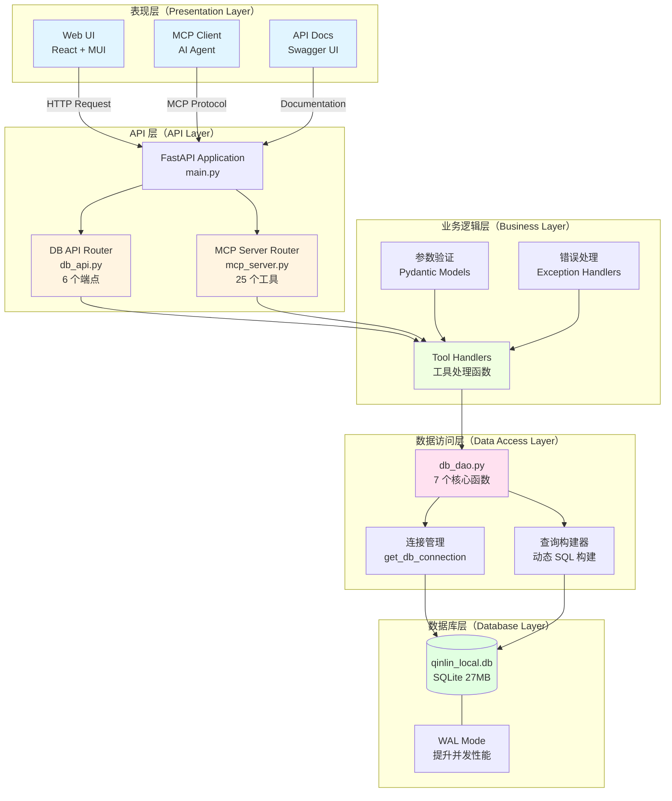
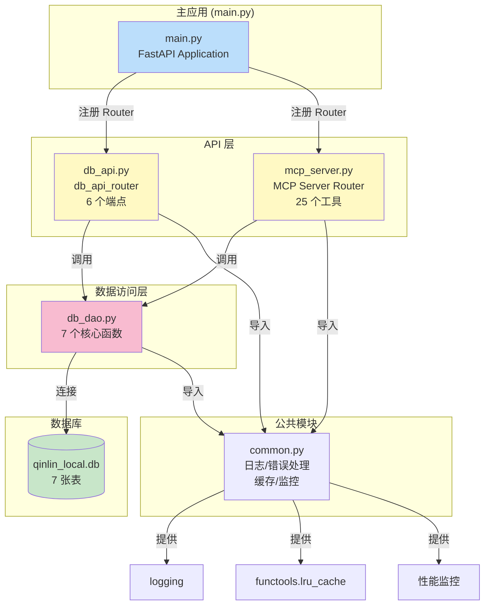
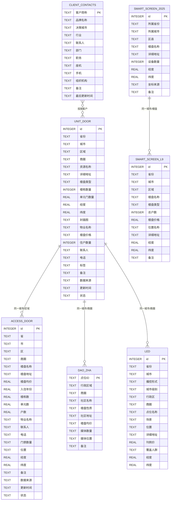
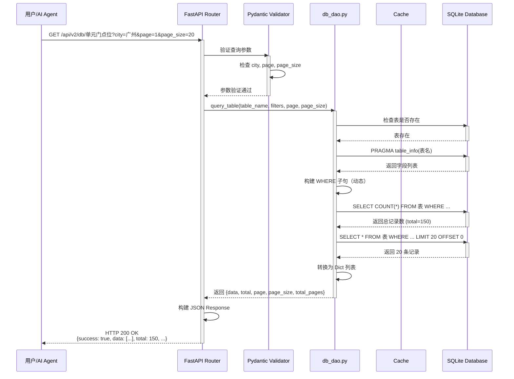
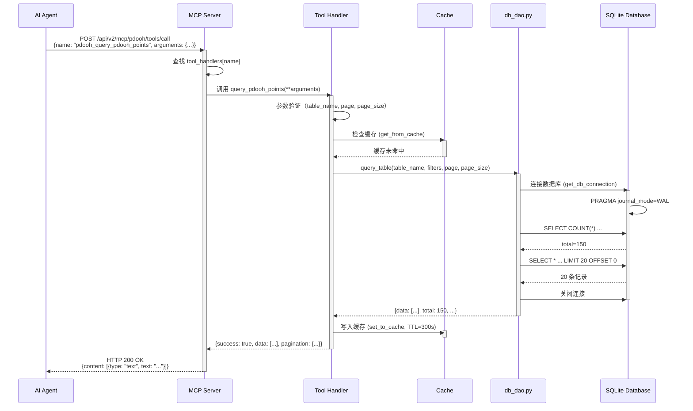

# AIAdPlacer 数据库集成 - 架构设计文档

**版本**: v1.0.0  
**日期**: 2026-03-04  
**作者**: 高见远（Gao）- 架构师  
**项目**: AIAdPlacer pDOOH AI 原生投放系统

---

## 目录

1. [架构概述](#1-架构概述)
2. [系统架构图](#2-系统架构图)
3. [数据流向图](#3-数据流向图)
4. [模块依赖图](#4-模块依赖图)
5. [数据库表结构图](#5-数据库表结构图)
6. [API 调用时序图](#6-api-调用时序图)
7. [模块设计](#7-模块设计)
8. [数据模型](#8-数据模型)
9. [错误处理](#9-错误处理)
10. [性能优化](#10-性能优化)
11. [安全设计](#11-安全设计)
12. [技术栈总结](#12-技术栈总结)

---

## 1. 架构概述

### 1.1 分层架构设计

AIAdPlacer 数据库集成采用经典的四层架构设计，遵循关注点分离原则：

```
┌─────────────────────────────────────────────────────────────┐
│                  表现层（Presentation Layer）                │
│          Web UI / MCP Client / API Docs                    │
└─────────────────────────────────────────────────────────────┘
                           ↓
┌─────────────────────────────────────────────────────────────┐
│                  API 层（API Layer）                       │
│         FastAPI Router (db_api_router)                     │
│         Endpoint: /api/v2/db/*                             │
└─────────────────────────────────────────────────────────────┘
                           ↓
┌─────────────────────────────────────────────────────────────┐
│               业务逻辑层（Business Layer）                    │
│         MCP Server (mcp_server.py)                        │
│         Tool Handlers (25 个工具)                          │
└─────────────────────────────────────────────────────────────┘
                           ↓
┌─────────────────────────────────────────────────────────────┐
│             数据访问层（Data Access Layer）                  │
│         DAO (db_dao.py)                                   │
│         7 个核心函数                                        │
└─────────────────────────────────────────────────────────────┘
                           ↓
┌─────────────────────────────────────────────────────────────┐
│               数据库层（Database Layer）                     │
│         SQLite (qinlin_local.db, 27MB)                   │
│         7 张表，共 117,192 条记录                          │
└─────────────────────────────────────────────────────────────┘
```

### 1.2 设计模式

| 设计模式 | 应用场景 | 优势 |
|---------|---------|------|
| **DAO 模式** | `db_dao.py` 封装所有数据库操作 | 隔离数据访问逻辑，便于单元测试和维护 |
| **Router 模式** | `db_api.py` 使用 FastAPI Router | 模块化 API 组织，支持前缀和标签分组 |
| **Tool Handler 模式** | `mcp_server.py` 工具处理函数 | 统一入口，便于权限控制和监控 |
| **Cache-Aside 模式** | `@cached` 装饰器 + TTL | 减少数据库查询，提升响应速度 |

---

## 2. 系统架构图



---

## 3. 数据流向图

```mermaid
flowchart LR
    subgraph "用户请求"
        U1[用户/AI Agent]
    end

    subgraph "API 层"
        A1[FastAPI Router<br/>db_api_router]
        A2[MCP Server<br/>mcp_server.py]
    end

    subgraph "业务逻辑层"
        B1[参数验证<br/>Pydantic]
        B2[Tool Handler<br/>工具处理函数]
        B3[缓存检查<br/>@cached]
    end

    subgraph "数据访问层"
        C1[db_dao.py]
        C2[SQL 构建器]
        C3[连接池]
    end

    subgraph "数据库层"
        D1[(qinlin_local.db)]
    end

    subgraph "响应返回"
        R1[JSON Response]
        R2[数据序列化]
    end

    U1 -->|1. HTTP Request| A1
    U1 -->|1. MCP Request| A2
    
    A1 -->|2. 路由分发| B1
    A2 -->|2. 工具调用| B2
    
    B1 -->|3. 验证通过| B2
    B2 -->|4. 检查缓存| B3
    
    B3 -->|5a. 缓存命中| R2
    B3 -->|5b. 缓存未命中| C1
    
    C1 -->|6. 构建 SQL| C2
    C2 -->|7. 执行查询| C3
    C3 -->|8. SQL 查询| D1
    
    D1 -->|9. 返回数据| C3
    C3 -->|10. 数据返回| C1
    C1 -->|11. 结果返回| B2
    B2 -->|12. 写入缓存| B3
    B2 -->|13. 返回结果| R2
    R2 -->|14. JSON 序列化| R1
    R1 -->|15. HTTP Response| U1

    style U1 fill:#e3f2fd
    style D1 fill:#e8f5e9
    style R1 fill:#fff3e0
```

### 数据流向说明

**写入流程（WAL Mode）**：
1. 用户发起请求（HTTP 或 MCP 协议）
2. FastAPI Router 接收请求并路由到对应的处理函数
3. Pydantic 模型验证请求参数
4. 检查内存缓存（TTL 300s）
5. 缓存未命中，调用 DAO 层
6. DAO 层构建参数化 SQL 查询（防 SQL 注入）
7. 通过 `sqlite3.connect()` 获取连接（WAL Mode）
8. 执行查询并返回结果
9. 结果写入缓存（下次请求直接返回）
10. 序列化为 JSON 格式返回给用户

---

## 4. 模块依赖图



### 模块依赖关系说明

| 模块 | 依赖模块 | 依赖类型 |
|------|---------|---------|
| **main.py** | db_api.py, mcp_server.py | 注册 Router |
| **db_api.py** | db_dao.py, common.py | 调用 DAO 函数 / 使用公共工具 |
| **mcp_server.py** | db_dao.py, common.py | 调用 DAO 函数 / 使用公共工具 |
| **db_dao.py** | sqlite3, common.py | 数据库连接 / 日志 |
| **common.py** | logging, functools | 无业务模块依赖（被所有模块依赖） |

---

## 5. 数据库表结构图

### 5.1 实体关系图（ER Diagram）



### 5.2 数据库表统计信息

| 表名 | 记录数 | 字段数 | 主要用途 | 关键字段 |
|------|--------|--------|---------|---------|
| **单元门点位** | 8,114 | 24 | 社区单元门广告 | 楼盘价格、经度、纬度 |
| **门禁点位** | 66,308 | 23 | 社区门禁广告 | 楼盘均价、经度、纬度 |
| **道闸点位** | 1,021 | 19 | 社区道闸广告 | 楼盘均价、媒体数量 |
| **商场LED点位** | 1,365 | 25 | 商场 LED 广告 | 刊例价、覆盖人群 |
| **智能屏202507** | 4,488 | 11 | 社区智能屏 | 设备数量、经纬度 |
| **智能屏L9** | 9,801 | 13 | 社区智能屏 L9 | 楼盘价格、总户数 |
| **客户通讯录** | 26,895 | 12 | 客户信息管理 | 品牌名称、决策城市、行业 |

**总计**: 117,192 条记录，147 个字段

---

## 6. API 调用时序图

### 6.1 查询表数据时序图



### 6.2 MCP 工具调用时序图



---

## 7. 模块设计

### 7.1 数据库访问层（db_dao.py）

#### 提供的接口（7 个核心函数）

| 函数名 | 功能 | 输入参数 | 返回值 | 用途 |
|--------|------|---------|--------|------|
| **get_all_tables()** | 获取所有表信息 | 无 | `List[Dict]` | 表名、记录数、字段列表 |
| **query_table()** | 查询表数据（分页/筛选） | table_name, filters, page, page_size | `Dict` | 分页数据、总数、页数 |
| **get_table_stats()** | 获取表统计信息 | table_name | `Dict` | 按城市/省份统计、坐标统计 |
| **search_table()** | 全文搜索 | table_name, keyword | `List[Dict]` | 匹配记录（最多100条） |
| **search_clients()** | 搜索客户信息 | keyword, city, industry, limit | `List[Dict]` | 客户通讯录查询 |
| **get_points_by_type()** | 按媒体类型获取点位 | point_type, city, district, limit | `Dict` | 统一点位查询接口 |
| **get_db_connection()** | 获取数据库连接 | 无 | `sqlite3.Connection` | 内部使用，WAL Mode |

#### 设计亮点

**1. 字段存在检查（动态适配）**
```python
# 智能检查价格字段是否存在
if "楼盘价格" in existing_columns:
    price_clauses.append('"楼盘价格" >= ?')
if "刊例价" in existing_columns:
    price_clauses.append('"刊例价" >= ?')
```
- **问题**: 不同表的字段名不同（楼盘价格 vs 刊例价）
- **解决**: 动态检查 `PRAGMA table_info` 返回的字段列表
- **优势**: 同一套代码适配所有表，无需硬编码

**2. 参数化查询（防 SQL 注入）**
```python
# ✅ 安全：使用参数化查询
cursor.execute("SELECT * FROM table WHERE city LIKE ?", (f"%{city}%",))

# ❌ 危险：字符串拼接（禁止）
cursor.execute(f"SELECT * FROM table WHERE city LIKE '%{city}%'")
```
- **所有用户输入都通过参数传递**，不直接拼接到 SQL 中
- **LIKE 查询也使用参数**: `LIKE ?` + `f"%{keyword}%"`

**3. 连接管理（自动关闭）**
```python
def get_db_connection():
    conn = sqlite3.connect(str(DB_PATH))
    conn.row_factory = sqlite3.Row  # 使结果可以通过列名访问
    conn.execute("PRAGMA journal_mode=WAL")  # WAL 模式提升并发
    return conn

# 使用 try-finally 确保连接关闭
try:
    conn = get_db_connection()
    # ... 执行查询
finally:
    conn.close()
```

### 7.2 API 层（db_api.py）

#### 提供的端点（6 个）

| HTTP 方法 | 端点 | 功能 | 参数 | 响应格式 |
|-----------|------|------|------|---------|
| **GET** | `/api/v2/db/tables` | 获取所有表 | 无 | `{success, data: [{name, count, columns}]}` |
| **GET** | `/api/v2/db/{table_name}` | 查询表数据 | province, city, district, page, page_size | `{success, data: [...], total, page, ...}` |
| **GET** | `/api/v2/db/stats/{table_name}` | 获取统计信息 | 路径参数 table_name | `{success, data: {total_count, city_stats, ...}}` |
| **GET** | `/api/v2/db/search/{table_name}` | 全文搜索 | q (关键词), limit | `{success, data: [...], total}` |
| **GET** | `/api/v2/db/clients/search` | 搜索客户 | keyword, city, industry, limit | `{success, data: [...], total}` |
| **GET** | `/api/v2/db/points/{point_type}` | 按类型获取点位 | point_type, city, district, limit | `{success, data: [...], total}` |

#### 请求/响应格式

**请求示例**:
```http
GET /api/v2/db/单元门点位?city=广州&district=天河&page=1&page_size=20
Host: 47.253.159.62:9000
```

**响应示例**:
```json
{
  "success": true,
  "data": [
    {
      "id": 1,
      "省份": "广东省",
      "城市": "广州市",
      "区域": "天河区",
      "商圈": "珠江新城",
      "资源名称": "XXX小区",
      "楼盘价格": 50000,
      "经度": 113.3245,
      "纬度": 23.1291
    }
  ],
  "total": 150,
  "page": 1,
  "page_size": 20,
  "total_pages": 8
}
```

**错误响应示例**:
```json
{
  "success": false,
  "error": "表不存在: 不存在的表",
  "code": "VALIDATION_ERROR"
}
```

### 7.3 MCP 集成（mcp_server.py）

#### 新增的 3 个工具

| 工具名称 | 功能 | 参数 | 返回 |
|---------|------|------|------|
| **pdooh_query_pdooh_points** | 查询点位数据（通用） | table_name, filters, page, page_size | 分页数据 + 统计 |
| **pdooh_get_point_stats** | 获取点位统计 | table_name, group_by | 按城市/省份/商圈分组统计 |
| **pdooh_search_clients** | 搜索客户信息 | keyword, city, industry, limit | 匹配的客户列表 |

#### 工具调用流程

```python
# 1. AI Agent 发送 MCP 请求
POST /api/v2/mcp/pdooh/tools/call
{
  "name": "pdooh_query_pdooh_points",
  "arguments": {
    "table_name": "单元门点位",
    "filters": {"city": "广州", "min_price": 30000},
    "page": 1,
    "page_size": 20
  }
}

# 2. MCP Server 路由到对应的 handler
tool_handlers = {
  "pdooh_query_pdooh_points": query_pdooh_points,
  ...
}
handler = tool_handlers[request.name]
result = await handler(**request.arguments)

# 3. Handler 调用 DAO 层
result = query_table(table_name, filters, page, page_size)

# 4. 返回标准化响应
{
  "success": True,
  "data": [...],
  "pagination": {...}
}
```

#### 缓存策略

- **TTL**: 300 秒（5 分钟）
- **最大缓存条目**: 100
- **缓存键**: `{tool_name}:{json.dumps(arguments, sort_keys=True)}`
- **装饰器**: `@cached(ttl=300, maxsize=100)`

---

## 8. 数据模型

### 8.1 数据库表结构详细设计

#### 表 1: 单元门点位（8,114 条记录）

| 字段名 | 类型 | 说明 | 索引建议 |
|--------|------|------|---------|
| **id** | INTEGER | 主键，自增 | PRIMARY KEY |
| **省份** | TEXT | 省份名称（如 "广东省"） | INDEX |
| **城市** | TEXT | 城市名称（如 "广州市"） | INDEX |
| **区域** | TEXT | 行政区（如 "天河区"） | INDEX |
| **商圈** | TEXT | 商圈名称（如 "珠江新城"） | INDEX |
| **资源名称** | TEXT | 小区/楼盘名称 | - |
| **详细地址** | TEXT | 完整地址 | - |
| **楼盘类型** | TEXT | 住宅/商业/写字楼 | - |
| **楼栋数量** | INTEGER | 楼栋总数 | - |
| **单元门数量** | REAL | 单元门总数 | - |
| **经度** | REAL | GPS 经度 | INDEX (R-Tree) |
| **纬度** | REAL | GPS 纬度 | INDEX (R-Tree) |
| **封面图** | TEXT | 图片 URL | - |
| **物业名称** | TEXT | 物业公司 | - |
| **楼盘价格** | REAL | 房价（元/㎡） | INDEX |
| **住户数量** | INTEGER | 总户数 | - |
| **联系人** | TEXT | 物业联系人 | - |
| **电话** | TEXT | 联系电话 | - |
| **标签** | TEXT | 标签列表（逗号分隔） | - |
| **备注** | TEXT | 额外信息 | - |
| **数据来源** | TEXT | 数据来源渠道 | - |
| **更新时间** | TEXT | 最后更新时间 | INDEX |
| **状态** | TEXT | 有效/无效 | INDEX |

#### 表 2: 客户通讯录（26,895 条记录）

| 字段名 | 类型 | 说明 | 索引建议 |
|--------|------|------|---------|
| **客户简称** | TEXT | 客户简称（主键） | PRIMARY KEY |
| **品牌名称** | TEXT | 品牌全称 | INDEX |
| **决策城市** | TEXT | 主要决策城市 | INDEX |
| **行业** | TEXT | 行业分类 | INDEX |
| **联系人** | TEXT | 主要联系人 | - |
| **部门** | TEXT | 所在部门 | - |
| **职务** | TEXT | 职位 | - |
| **座机** | TEXT | 固定电话 | - |
| **手机** | TEXT | 手机号码 | - |
| **组织机构** | TEXT | 公司架构 | - |
| **备注** | TEXT | 额外信息 | - |
| **最后更新时间** | TEXT | 最后更新时间 | INDEX |

### 8.2 关键字段说明

#### 价格字段

| 表名 | 价格字段 | 单位 | 说明 |
|------|---------|------|------|
| 单元门点位 | **楼盘价格** | 元/㎡ | 二手房均价 |
| 门禁点位 | **楼盘均价** | 元/㎡ | 新房/二手房均价 |
| 道闸点位 | **楼盘均价** | 元/㎡ | 文本格式（需转换） |
| 商场LED点位 | **刊例价** | 元/月 | 广告刊例价 |
| 智能屏L9 | **楼盘价格** | 元/㎡ | 房价 |

**价格筛选处理**:
```python
# 智能识别价格字段
price_fields = ["楼盘价格", "楼盘均价", "刊例价"]
for field in price_fields:
    if field in existing_columns:
        where_clauses.append(f'"{field}" >= ?')
        params.append(min_price)
```

#### 经纬度字段

| 表名 | 经度字段 | 纬度字段 | 坐标来源字段 |
|------|---------|---------|-------------|
| 单元门点位 | 经度 | 纬度 | - |
| 门禁点位 | 经度 | 纬度 | - |
| 商场LED点位 | 经度 | 纬度 | - |
| 智能屏202507 | 经度 | 纬度 | 坐标来源 |
| 智能屏L9 | 经度 | 纬度 | - |

**坐标统计**:
```python
# 统计有坐标的记录数
SELECT COUNT(*) FROM 表 WHERE 经度 IS NOT NULL AND 纬度 IS NOT NULL
```

---

## 9. 错误处理

### 9.1 统一错误处理策略

```
┌─────────────────────────────────────────────────────────────┐
│                    错误产生                                   │
│   ValueError / FileNotFoundError / Exception                │
└─────────────────────────────────────────────────────────────┘
                           ↓
┌─────────────────────────────────────────────────────────────┐
│                  Pydantic 参数验证                           │
│   raise ValidationError(message, details)                  │
└─────────────────────────────────────────────────────────────┘
                           ↓
┌─────────────────────────────────────────────────────────────┐
│                  DAO 层异常捕获                              │
│   try: ... except ValueError: ... except Exception: ...    │
└─────────────────────────────────────────────────────────────┘
                           ↓
┌─────────────────────────────────────────────────────────────┐
│                  API 层异常映射                              │
│   ValueError → 400 (VALIDATION_ERROR)                      │
│   FileNotFoundError → 404 (DATABASE_NOT_FOUND)            │
│   Exception → 500 (INTERNAL_ERROR)                        │
└─────────────────────────────────────────────────────────────┘
                           ↓
┌─────────────────────────────────────────────────────────────┐
│                  返回标准化错误响应                           │
│   {                                                       │
│     "success": false,                                     │
│     "error": "错误信息",                                   │
│     "code": "ERROR_CODE"                                  │
│   }                                                       │
└─────────────────────────────────────────────────────────────┘
```

### 9.2 常见错误码和错误信息

| HTTP 状态码 | 错误码 | 错误信息 | 触发场景 |
|------------|--------|---------|---------|
| **400** | VALIDATION_ERROR | 表不存在: {table_name} | 查询不存在的表 |
| **400** | VALIDATION_ERROR | page 必须 >= 1 | 页码参数错误 |
| **400** | VALIDATION_ERROR | page_size 必须在 1-100 之间 | 分页大小参数错误 |
| **400** | INVALID_POINT_TYPE | 不支持的点位类型: {point_type} | 点位类型错误 |
| **404** | DATABASE_NOT_FOUND | 数据库文件不存在: {path} | 数据库文件丢失 |
| **404** | TABLE_NOT_FOUND | 表不存在: {table_name} | 统计不存在的表 |
| **500** | INTERNAL_ERROR | 服务器内部错误 | 未预期的异常 |

### 9.3 错误日志策略

```python
# WARNING 级别：参数错误（用户输入问题）
logger.warning(f"查询表数据失败: {str(e)}")

# ERROR 级别：系统错误（需要介入）
logger.error(f"查询表数据失败: 数据库文件不存在 - {str(e)}")
logger.error(f"搜索失败: {str(e)}", exc_info=True)  # 记录完整堆栈
```

---

## 10. 性能优化

### 10.1 分页查询（避免一次性加载大量数据）

**问题**: 如果一次性查询所有记录，会导致：
- 内存占用过高（特别是 66,308 条记录的门禁点位表）
- 响应时间过长（用户体验差）
- 网络传输压力大

**解决方案**: 分页查询 + 限制最大值

```python
# 分页参数验证
if page_size < 1 or page_size > 1000:
    raise ValueError("page_size 必须在 1-1000 之间")

# 计算 OFFSET
offset = (page - 1) * page_size

# 分页查询
sql = f'SELECT * FROM "{table_name}" {where_sql} LIMIT ? OFFSET ?'
cursor = conn.execute(sql, params + [page_size, offset])
```

**分页响应格式**:
```json
{
  "data": [...],       // 当前页数据（最多 1000 条）
  "total": 150,        // 总记录数
  "page": 1,           // 当前页码
  "page_size": 20,     // 每页记录数
  "total_pages": 8     // 总页数
}
```

### 10.2 字段存在检查（动态适配不同表结构）

**问题**: 不同表的字段名不同，例如：
- 单元门点位：`楼盘价格`
- 商场LED点位：`刊例价`
- 道闸点位：`楼盘均价`

**解决方案**: 动态检查字段是否存在

```python
# 获取表的字段列表
schema_cursor = conn.execute(f'PRAGMA table_info("{table_name}")')
existing_columns = [col[1] for col in schema_cursor.fetchall()]

# 智能构建价格筛选条件
price_clauses = []
if "楼盘价格" in existing_columns:
    price_clauses.append('"楼盘价格" >= ?')
    params.append(filters['min_price'])
if "刊例价" in existing_columns:
    price_clauses.append('"刊例价" >= ?')
    params.append(filters['min_price'])

if price_clauses:
    where_clauses.append("(" + " OR ".join(price_clauses) + ")")
else:
    logger.warning(f"表 {table_name} 没有价格字段，跳过价格过滤")
```

**优势**:
- 同一套代码适配所有表
- 新增表无需修改代码
- 避免因字段不存在导致的 SQL 错误

### 10.3 内存缓存（减少数据库查询）

**缓存策略**:
- **TTL**: 300 秒（5 分钟）
- **最大缓存条目**: 100
- **缓存键**: `{tool_name}:{json.dumps(arguments, sort_keys=True)}`

**实现**:
```python
from functools import lru_cache

def cached(ttl=300, maxsize=100):
    """自定义缓存装饰器（支持 TTL）"""
    def decorator(func):
        cache = {}
        cache_times = {}
        
        @wraps(func)
        def wrapper(*args, **kwargs):
            key = f"{func.__name__}:{str(args)}:{str(kwargs)}"
            
            # 检查缓存
            if key in cache:
                if time.time() - cache_times[key] < ttl:
                    return cache[key]
                else:
                    del cache[key]
                    del cache_times[key]
            
            # 执行函数
            result = func(*args, **kwargs)
            
            # 写入缓存
            if len(cache) < maxsize:
                cache[key] = result
                cache_times[key] = time.time()
            
            return result
        
        return wrapper
    return decorator

# 使用缓存
@cached(ttl=300, maxsize=100)
async def query_pdooh_points(table_name, filters, page, page_size):
    # ... 查询数据库
    return result
```

### 10.4 WAL 模式（提升并发性能）

**问题**: SQLite 默认使用 DELETE 模式，写操作会阻塞读操作。

**解决方案**: 启用 WAL（Write-Ahead Logging）模式

```python
def get_db_connection():
    conn = sqlite3.connect(str(DB_PATH))
    conn.execute("PRAGMA journal_mode=WAL")  # 启用 WAL 模式
    return conn
```

**WAL 模式优势**:
- 读写并发（读不阻塞写，写不阻塞读）
- 写入性能提升（批量写入）
- 崩溃恢复更安全

---

## 11. 安全设计

### 11.1 参数化查询（防 SQL 注入）

**SQL 注入示例**:
```python
# ❌ 危险：字符串拼接
city = "广州' OR '1'='1"
sql = f"SELECT * FROM 表 WHERE city = '{city}'"
# 最终 SQL: SELECT * FROM 表 WHERE city = '广州' OR '1'='1'
# 结果：返回所有记录（注入成功）
```

**参数化查询示例**:
```python
# ✅ 安全：使用参数化查询
city = "广州' OR '1'='1"
cursor.execute("SELECT * FROM 表 WHERE city = ?", (city,))
# 最终 SQL: SELECT * FROM 表 WHERE city = '广州'' OR ''1''=''1'
# 结果：查询城市名为 "广州' OR '1'='1" 的记录（注入失败）
```

**所有 DAO 函数都使用参数化查询**:
```python
# 模糊查询也使用参数
cursor.execute('SELECT * FROM 表 WHERE city LIKE ?', (f"%{city}%",))

# IN 查询也使用参数（多个 ?）
placeholders = ','.join(['?'] * len(city_list))
cursor.execute(f'SELECT * FROM 表 WHERE city IN ({placeholders})', city_list)
```

### 11.2 数据库文件不提交到 Git（.gitignore）

**.gitignore 配置**:
```gitignore
# 数据库文件（包含敏感信息）
backend/data/*.db
backend/data/*.sqlite
backend/data/*.db-journal
backend/data/*.db-wal

# 但保留空目录结构
!backend/data/.gitkeep
```

**原因**:
- 数据库文件可能包含敏感信息（客户联系方式、价格等）
- 数据库文件较大（27MB），不适合版本控制
- 数据库文件是二进制文件，Git 无法有效 diff

**解决方案**:
- 将数据库文件添加到 `.gitignore`
- 提供数据库初始化脚本（`scripts/init_db.py`）
- 在 `README.md` 中说明如何获取数据库文件

### 11.3 输入验证（防 XSS 和恶意输入）

**Pydantic 参数验证**:
```python
from pydantic import BaseModel, validator

class QueryTableRequest(BaseModel):
    province: Optional[str] = None
    city: Optional[str] = None
    page: int = 1
    page_size: int = 20
    
    @validator('page')
    def page_must_be_positive(cls, v):
        if v < 1:
            raise ValueError('page 必须 >= 1')
        return v
    
    @validator('page_size')
    def page_size_must_be_valid(cls, v):
        if v < 1 or v > 100:
            raise ValueError('page_size 必须在 1-100 之间')
        return v
```

**验证规则**:
- **page**: 必须 >= 1
- **page_size**: 必须在 1-100 之间（API 层），1-1000 之间（DAO 层）
- **table_name**: 必须通过 `sqlite_master` 检查表是否存在
- **keyword**: 不能为空（搜索接口）

---

## 12. 技术栈总结

### 12.1 后端技术栈

| 技术 | 版本 | 用途 |
|------|------|------|
| **Python** | 3.9+ | 后端编程语言 |
| **FastAPI** | 0.104+ | Web 框架（高性能、自动生成 API 文档） |
| **SQLite** | 3.x | 嵌入式数据库（轻量级、零配置） |
| **Pydantic** | 2.x | 参数验证和数据模型 |
| **httpx** | 0.25+ | 异步 HTTP 客户端（用于调用 MCP 服务） |
| **uvicorn** | 0.24+ | ASGI 服务器 |

### 12.2 开发工具

| 工具 | 用途 |
|------|------|
| **pytest** | 单元测试（29 个测试用例） |
| **logging** | 日志记录 |
| **functools.lru_cache** | 内存缓存 |
| **asyncio** | 异步编程 |

### 12.3 部署建议

| 项目 | 建议 |
|------|------|
| **Web 服务器** | uvicorn + nginx（反向代理） |
| **进程管理** | systemd / supervisor |
| **数据库备份** | 每日定时备份（`cron + rsync`） |
| **监控** | Prometheus + Grafana（监控 API 响应时间、错误率） |
| **日志** | ELK Stack（集中式日志管理） |

---

## 13. 附录

### 13.1 完整的文件列表

```
AIAdPlacer/
├── backend/
│   ├── app/
│   │   ├── __init__.py
│   │   ├── main.py                  # FastAPI 主应用（注册 Router）
│   │   ├── db_dao.py               # 数据库访问层（7 个函数）
│   │   ├── db_api.py               # RESTful API 接口（6 个端点）
│   │   ├── mcp_server.py           # MCP Server（25 个工具）
│   │   └── common.py               # 公共模块（日志/错误处理/缓存）
│   ├── data/
│   │   ├── qinlin_local.db        # SQLite 数据库（27MB，不提交到 Git）
│   │   └── .gitkeep               # 保留空目录
│   ├── tests/
│   │   ├── test_db_dao.py         # DAO 层测试（29 个用例）
│   │   └── test_db_api.py         # API 层测试（待补充）
│   └── logs/
│       ├── mcp_server.log          # MCP Server 日志
│       └── db_api.log              # DB API 日志
├── docs/
│   ├── Architecture-Database-Integration.md    # 本文档
│   ├── API-Documentation.md       # API 文档
│   └── Database-Schema.md         # 数据库表结构文档
└── .gitignore                     # Git 忽略配置（包含 *.db）
```

### 13.2 测试覆盖

| 模块 | 测试文件 | 测试用例数 | 覆盖率目标 |
|------|---------|-----------|-----------|
| **db_dao.py** | test_db_dao.py | 29 | 90%+ |
| **db_api.py** | test_db_api.py | 待补充 | 80%+ |
| **mcp_server.py** | test_mcp_server.py | 待补充 | 80%+ |

### 13.3 未来优化方向

1. **数据库迁移到 PostgreSQL**（支持更大并发、更大数据量）
2. **添加 Redis 缓存层**（替代内存缓存，支持分布式部署）
3. **实现 GraphQL API**（替代 RESTful，更灵活的数据查询）
4. **添加全文搜索引擎**（Elasticsearch，替代 SQL LIKE 查询）
5. **实现数据库读写分离**（主从复制，提升读取性能）

---

## 14. 联系方式

- **架构师**: 高见远（Gao）
- **项目**: AIAdPlacer pDOOH AI 原生投放系统
- **邮箱**: architect@aiadplacer.com
- **文档版本**: v1.0.0
- **最后更新**: 2026-03-04

---

**文档结束**
