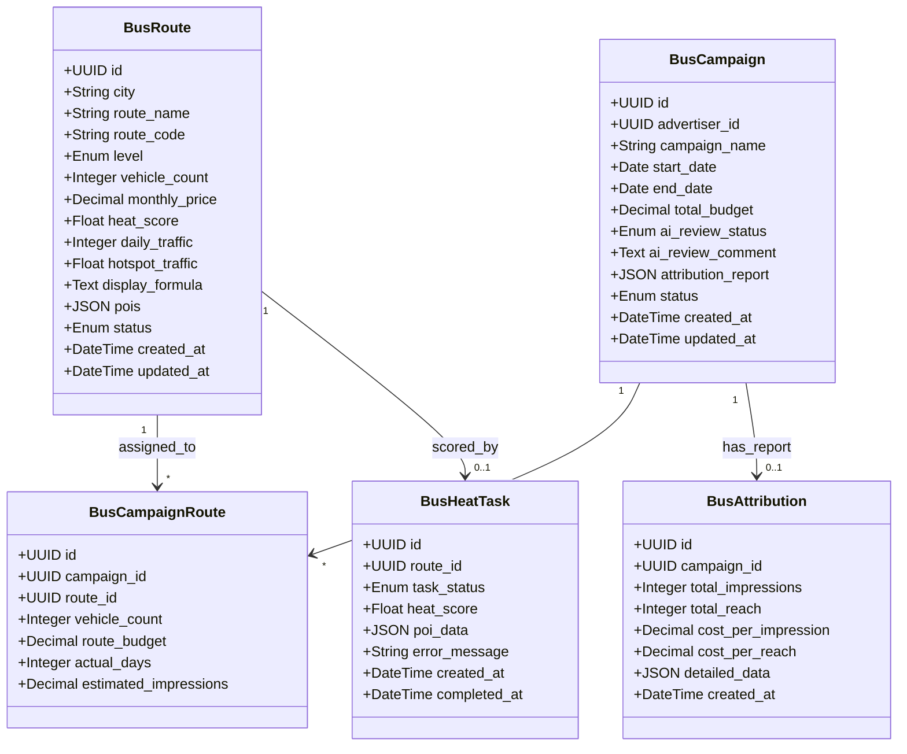
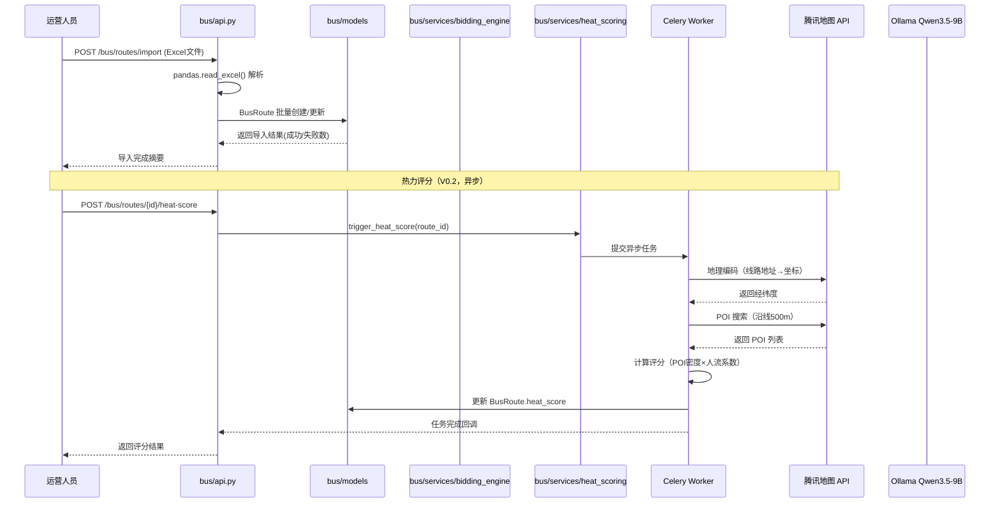
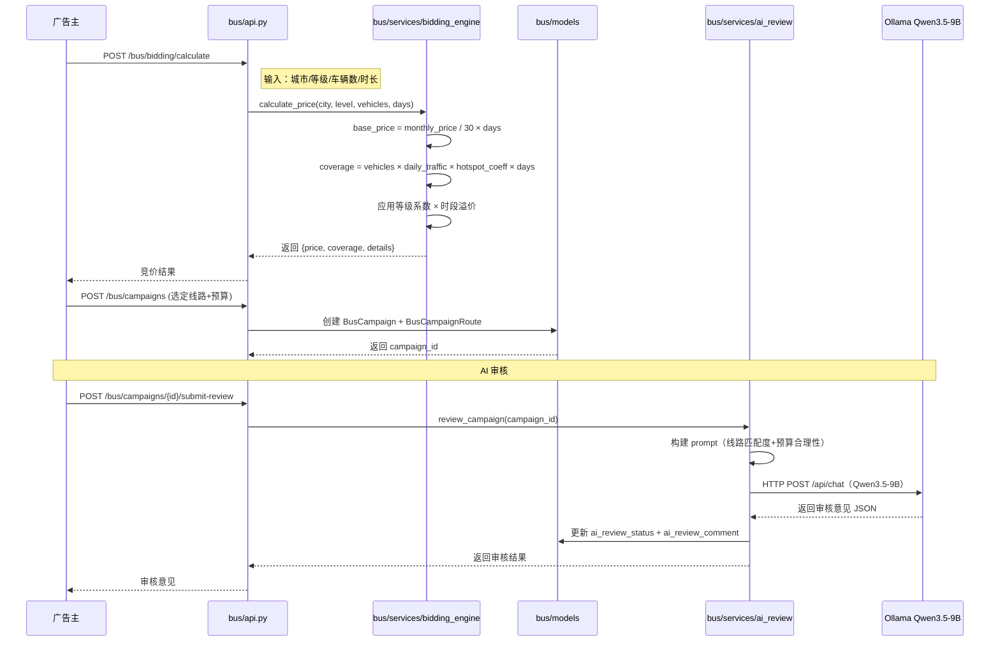
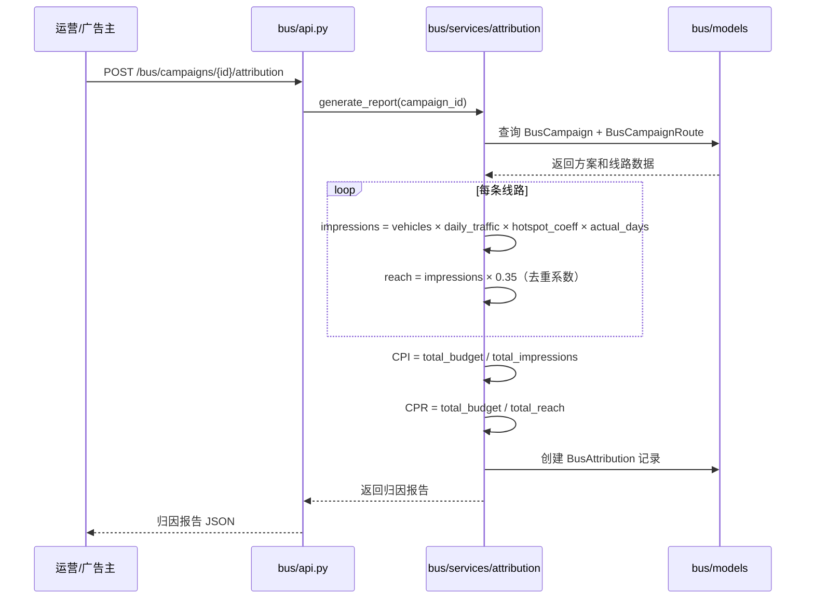
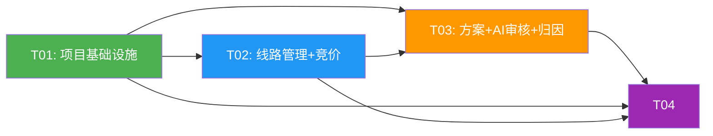

# bus-pDOOH 系统架构设计

> **文档版本**：v1.0 | **作者**：Bob（架构师）| **日期**：2026-05-31
> **基于 PRD**：`docs/bus-pdooh-prd.md`

---

## Part A: System Design

### 1. 实现方案 + 框架选型

#### 1.1 架构决策：扩展现有 app（非独立 app）

**决策理由**：
- PRD 已确认 Q6：bus-pDOOH 是 AIAdPlacer 的**子系统**，共享用户/订单/支付模块
- 现有 `pdooh_api.py` 和 `pdooh_mcp.py` 已采用**同进程多 Router** 模式（FastAPI `include_router`），bus-pDOOH 应延续此模式
- 独立 app 会增加部署复杂度和跨服务通信成本（Redis/消息队列），对 MVP 阶段不划算

**架构模式**：**模块化单体（Modular Monolith）**
```
AIAdPlacer (FastAPI 单体应用)
├── /api/v1/        → 原有社区门禁模块（MediaResource/Campaign）
├── /api/v2/pdooh/  → 原 pDOOH 智能屏模块（screen/person/POI）
├── /api/v2/bus/    → ✨ bus-pDOOH 公交模块（新增）
├── /api/v2/mcp/    → MCP A2A 接口
└── /agents/        → LangGraph 编排器
```

#### 1.2 数据库决策：复用 `ai_adplacer` 库，表前缀 `bus_`

**理由**：
- 现有 pDOOH 模块已采用多库模式（`pdooh` 库），但这种模式增加了连接管理复杂度
- bus-pDOOH 与现有系统的关联度更高（需要共享 Campaign、Audience 等概念）
- 用 `bus_` 前缀清晰隔离，迁移成本低
- 表名：`bus_routes`、`bus_campaigns`、`bus_campaign_routes`、`bus_heat_tasks`、`bus_attribution`

#### 1.3 核心技术挑战与选型

| 挑战 | 方案 | 选型 |
|------|------|------|
| Excel 批量导入 | pandas + openpyxl 解析，SQLAlchemy ORM 批量写入 | `pandas` + `openpyxl`（已有） |
| 热力评分计算 | 腾讯地图 WebService API（POI搜索+地理编码），异步 Celery 任务 | Celery + Redis（V0.2） |
| 竞价引擎 | 独立 Service 层，纯计算逻辑，响应 < 500ms | 同步函数（无外部依赖） |
| AI 审核 | Ollama Qwen3.5-9B HTTP 调用，prompt engineering | `httpx` 异步调用（已有 LLMClient 可扩展） |
| 效果归因 | 公式计算 + 人工数据录入，支持导出 | 同步计算 + Excel 导出 |

#### 1.4 新增依赖包

```
openpyxl>=3.1.0          # Excel 读写
celery>=5.3.0            # 异步任务队列（热力评分）
flower>=2.0.0            # Celery 监控（可选）
```

> 注：pandas、numpy、httpx、SQLAlchemy、pydantic 已在 requirements.txt 中。

---

### 2. 文件列表

```
backend/
├── app/
│   ├── bus/                              # ✨ bus-pDOOH 模块（新目录）
│   │   ├── __init__.py
│   │   ├── models.py                     # BusRoute, BusCampaign, BusCampaignRoute, BusHeatTask, BusAttribution
│   │   ├── schemas.py                    # Pydantic 请求/响应模型
│   │   ├── services/
│   │   │   ├── __init__.py
│   │   │   ├── bidding_engine.py         # 竞价引擎（核心计算）
│   │   │   ├── heat_scoring.py           # 热力评分服务（腾讯地图 API）
│   │   │   ├── ai_review.py              # AI 方案审核（Qwen3.5-9B）
│   │   │   └── attribution.py            # 效果归因计算
│   │   ├── tasks.py                      # Celery 异步任务（热力评分）
│   │   └── api.py                        # REST API 路由（/api/v2/bus/）
│   ├── services/
│   │   └── ollama_client.py              # ✨ Ollama HTTP 客户端（新增，复用给 AI 审核）
│   └── main.py                           # 修改：新增 bus_router 注册
├── bus-demo.html                         # ✨ 独立演示页面（根目录）
├── requirements.txt                      # 修改：新增 openpyxl, celery
└── celery_worker.py                      # ✨ Celery worker 入口（新增）
```

---

### 3. 数据结构和接口

#### 3.1 数据库模型（Mermaid classDiagram）



#### 3.2 API 接口清单

| 方法 | 路径 | 说明 |
|------|------|------|
| POST | `/api/v2/bus/routes/import` | Excel 批量导入线路 |
| GET  | `/api/v2/bus/routes` | 线路列表（支持城市/等级/价格/热力筛选） |
| GET  | `/api/v2/bus/routes/{id}` | 线路详情 |
| PUT  | `/api/v2/bus/routes/{id}` | 更新线路信息 |
| PUT  | `/api/v2/bus/routes/{id}/status` | 变更线路状态 |
| POST | `/api/v2/bus/routes/{id}/heat-score` | 触发热力评分计算 |
| GET  | `/api/v2/bus/heat-tasks/{id}` | 查询热力评分任务状态 |
| POST | `/api/v2/bus/bidding/calculate` | 竞价计算（核心） |
| POST | `/api/v2/bus/bidding/multi` | 多线路组合竞价 |
| POST | `/api/v2/bus/campaigns` | 创建投放方案 |
| GET  | `/api/v2/bus/campaigns` | 投放方案列表 |
| GET  | `/api/v2/bus/campaigns/{id}` | 方案详情 |
| POST | `/api/v2/bus/campaigns/{id}/submit-review` | 提交 AI 审核 |
| GET  | `/api/v2/bus/campaigns/{id}/review` | 获取审核结果 |
| POST | `/api/v2/bus/campaigns/{id}/attribution` | 生成效果归因报告 |
| GET  | `/api/v2/bus/recommend` | 智能线路推荐 |

---

### 4. 程序调用流程

#### 4.1 Excel 导入 + 热力评分流程



#### 4.2 竞价计算 + 投放方案流程



#### 4.3 效果归因流程



---

### 5. 待明确事项

| # | 问题 | 当前假设 | 建议 |
|---|------|----------|------|
| A1 | 广告主 ID（advertiser_id）的数据来源？是复用现有 Campaign 表的 advertiser 字段还是新建用户体系？ | 假设初期用 String 存储广告主名称，V1.0 再建立用户体系 | 需确认 |
| A2 | 时段溢价的具体系数？PRD 提到早晚高峰但无具体数值 | 假设早高峰(7-9)×1.3，晚高峰(17-19)×1.2，平峰×1.0 | 需运营确认 |
| A3 | 热力评分的具体权重？POI密度、周边人流、时段的权重比例 | 假设 POI密度40% + 人流40% + 时段20% | 需确认 |
| A4 | Celery 是否需要独立部署？还是与 FastAPI 同一进程？ | V0.2 同进程 Celery worker，V1.0 考虑分离 | 需运维确认 |
| A5 | bus-demo.html 的数据来源？纯 mock 还是调用真实后端 API？ | 假设 V0.1 mock 数据，V0.2 切换真实 API | 需确认 |
| A6 | 29城/95线路的 Excel 数据来源？是否有现成模板？ | 假设运营提供标准 Excel 模板 | 需运营提供 |

---

## Part B: Task Decomposition

### 6. Required Packages

```
# 新增依赖
openpyxl>=3.1.0          # Excel 文件读写（批量导入）
celery>=5.3.0            # 异步任务队列（热力评分计算）

# 已有依赖（无需新增）
pandas>=2.2.0            # Excel 解析 + 数据处理
numpy>=2.0.0             # 数值计算
httpx>=0.25.0            # HTTP 客户端（腾讯地图 API + Ollama）
SQLAlchemy>=2.0.0        # ORM
pydantic>=2.5.0          # 数据校验
FastAPI>=0.104.0         # Web 框架
```

### 7. Task List

#### T01: 项目基础设施 + bus 模块骨架
- **源文件**：
  - `backend/app/bus/__init__.py`（新建）
  - `backend/app/bus/models.py`（新建：5个 ORM 模型）
  - `backend/app/bus/schemas.py`（新建：Pydantic 请求/响应模型）
  - `backend/app/bus/services/__init__.py`（新建）
  - `backend/app/services/ollama_client.py`（新建：Ollama HTTP 客户端）
  - `backend/requirements.txt`（修改：新增 openpyxl, celery）
  - `backend/app/main.py`（修改：注册 bus_router）
- **依赖**：无
- **优先级**：P0

#### T02: 线路资源管理 + Excel 导入 + 搜索筛选
- **源文件**：
  - `backend/app/bus/api.py`（新建：REST API 路由）
  - `backend/app/bus/services/bidding_engine.py`（新建：竞价计算逻辑）
  - `backend/app/bus/services/heat_scoring.py`（新建：热力评分基础逻辑）
  - `backend/bus-demo.html`（新建：独立演示页面）
- **依赖**：T01
- **优先级**：P0

#### T03: 投放方案 + AI 审核 + 效果归因
- **源文件**：
  - `backend/app/bus/services/ai_review.py`（新建：AI 审核逻辑）
  - `backend/app/bus/services/attribution.py`（新建：归因计算）
  - `backend/app/bus/api.py`（扩展：方案/AI审核/归因 API）
  - `backend/app/bus/schemas.py`（扩展：方案/AI审核/归因 schema）
- **依赖**：T01, T02
- **优先级**：P1

#### T04: 热力评分异步任务 + Celery + bus-demo.html 完善
- **源文件**：
  - `backend/app/bus/tasks.py`（新建：Celery 异步任务定义）
  - `backend/celery_worker.py`（新建：Celery worker 入口）
  - `backend/app/bus/services/heat_scoring.py`（扩展：集成 Celery）
  - `backend/bus-demo.html`（完善：对接真实 API，热力地图展示）
- **依赖**：T01, T02, T03
- **优先级**：P2

---

### 8. Shared Knowledge

```python
# ── API 规范 ─────────────────────────────
# 所有 bus-pDOOH API 前缀：/api/v2/bus/
# 统一响应格式：
#   成功：{"code": 0, "data": {...}, "message": "success"}
#   失败：{"code": -1, "data": None, "message": "错误描述"}

# ── 数据库表前缀 ─────────────────────────
# bus_routes          # 线路资源
# bus_campaigns       # 投放方案
# bus_campaign_routes # 方案-线路关联
# bus_heat_tasks      # 热力评分任务
# bus_attribution     # 效果归因

# ── 线路等级系数 ─────────────────────────
LEVEL_MULTIPLIERS = {
    "S": 1.5,      # 超一线线路
    "A++": 1.3,    # 一线线路
    "A+": 1.1,     # 准一线线路
    "A": 1.0,      # 标准线路
}

# ── 热力评分范围 ─────────────────────────
HEAT_SCORE_MIN = 0
HEAT_SCORE_MAX = 100

# ── 竞价公式 ─────────────────────────────
# 展示量 = 车辆数 × daily_traffic × hotspot_traffic × 投放天数
# 基础价格 = 月单价 / 30 × 投放天数 × 等级系数 × 时段溢价
# 覆盖人群 = 车辆数 × daily_traffic × hotspot_traffic × 30

# ── Ollama 配置 ──────────────────────────
# Ollama 默认地址：http://127.0.0.1:11434
# 模型：Qwen3.5-9B（需确认 Ollama 中的实际模型名）
# 超时：30s

# ── 腾讯地图 API ─────────────────────────
# Key: 7HKBZ-HQBEM-XS56X-6DBAT-ITXUZ-IDF
# 基础 URL: https://apis.map.qq.com/ws/
# 已封装在 app/services/tencent_map.py，直接复用
```

### 9. Task Dependency Graph


