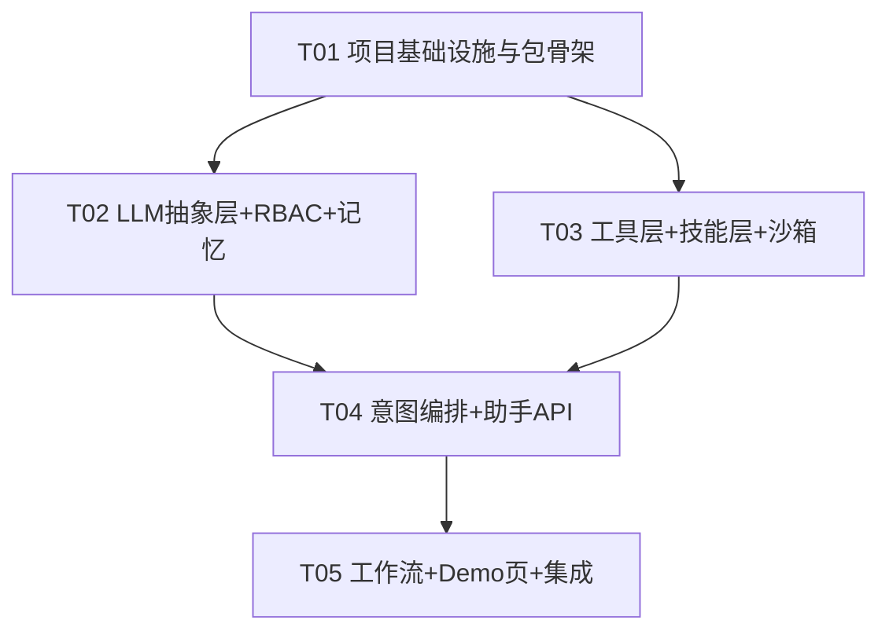

# 增量架构设计：青柠智能对话助手（Qinglin Assistant）

> 架构师: Bob (software-architect) | 收口: software-architect-2 | 版本: v1.2 | 状态: 评审通过（命名统一青柠/qinglin；原 P0「DB 未就位」经实测为误报，已改为复用既有 qinlin_local.db 验证级；LLMUnavailableError→503；Demo=web/index.html；DB 文件名沿用 qinlin_local.db 不改）
> 范围: AIAdPlacer(pDOOH) 后端增量模块 `backend/app/qinglin_assistant/`
> 依据: `incremental_prd_qinglin_assistant.md`（Alice 产出增量 PRD）

### 0. 命名边界（强制，贯穿全文）

| 对象 | 命名 |
|------|------|
| 新模块 / 类 / 字段 / API 路径 / 前端文案 / 品牌名 | `qinglin`、青柠 |
| 既有 `.db` 文件名（如 `qinlin_local.db`）、既有表名（`门禁点位` 等）、仓库根 `青柠*.db` | **原样不动** |

> **图表文件对照（避免与既有通用图混淆）**
> 本设计的类图 / 时序图为 `docs/qinglin_class-diagram.mermaid`、`docs/qinglin_sequence-diagram.mermaid`（`qinglin_` 前缀）。
> 同目录下无前缀的 `class-diagram.mermaid`、`sequence-diagram.mermaid` 属既有 Architecture-Database-Integration 专题，
> 与本增量模块**无关**，请勿引用、勿覆盖、勿合并。

> 增量助手模块一律使用 `qinglin`；但底层真实数据库文件名 `qinlin_local.db`、中文业务表名、仓库根 `青柠*.db` 保持原样，**绝不**改名 / 复制 / 移动。

---

## Part A：系统设计

### 1. 实现方案（Implementation Approach）

#### 1.1 需求难点分析
- **多角色 RBAC 与数据脱敏**：四角色（sale/media/engineer/developer）对同一助手入口，需拦截跨人/越权查询，并对手机号等敏感字段脱敏（138****1234）。
- **LLM 推理核心可切换**：默认本地 Ollama（合规/离线），需可经 env 切到 OpenAI/Claude/DashScope 等兼容 OpenAI 协议云端。
- **真实链路垂直切片**：知识库必须真查青柠真实 DB（`qinlin_local.db`），而非 mock；同时操作类（报备/锁点）必须明确标注「演示态」，绝不伪装写库。
- **工具编排 + 记忆**：自然语言 → 意图识别 → 工具分发 → 结果回填 LLM → 自然语言回复，且跨轮记忆。
- **安全沙箱**：`bash_tool` 需命令黑名单 + 资源限制 + 进程隔离。

#### 1.2 框架与库选型（全部复用既有地基）
| 能力 | 选型 | 理由 |
|------|------|------|
| Web 框架 | FastAPI + Pydantic（既有） | 与现有 `tom_agent.py`/`db_api.py` 同构，零学习成本 |
| LLM 本地 | `app.services.ollama_client.OllamaClient`（既有） | 默认 provider，封装 `/api/chat` |
| LLM 云端 | `openai.AsyncOpenAI`（兼容协议，既有依赖） | env 切换 OpenAI/Claude/DashScope |
| 真实知识库 | `app.db_dao`（既有 `qinlin_local.db`） | 真查青柠点位/客户，含样本库兜底 |
| 地图工具 | `app.services.tencent_map.TencentMapService`（既有） | `map_*` 工具直接复用 |
| 文档技能 | python-docx / openpyxl / python-pptx / reportlab（新增） | 产出真实 docx/xlsx/pptx/pdf |
| 沙箱 | 标准库 `subprocess` + 资源限制（新增封装） | 无需第三方，黑名单 + timeout 隔离 |
| 记忆 | sqlite 会话存储（`backend/data/qinglin_memory.db`，按 `session_id` 隔离） | 满足用户锁定决策 #4：session 级 + 持久化 |

#### 1.3 架构模式
- **分层 + Agentic 编排**：API 层（FastAPI Router）→ 编排层（`ToolOrchestrator` ReAct 风格循环）→ 能力层（LLM / Tools / Skills / Workflows / Sandbox）→ 基础设施层（RBAC / Memory / 真实 DB）。
- 遵循既有 `common` 基础设施（日志、错误格式、request_id、装饰器），保证与其他子系统测试不破。

---

### 2. 文件清单（File List）

全部位于 `backend/app/qinglin_assistant/`（相对 AIAdPlacer 后端，与 `services/`、`api/`、`agents/` 同级），Demo 页在 `web/`（即 `web/index.html`）：

```
backend/app/qinglin_assistant/
├── __init__.py                     # 包入口，导出 assistant_router
├── api/
│   ├── __init__.py
│   └── routes.py                   # FastAPI Router + ChatRequest/ChatResponse + /chat
├── rbac/
│   ├── __init__.py
│   └── policy.py                   # Role 枚举 + RBACPolicy + PermissionChecker + 脱敏
├── llm/
│   ├── __init__.py
│   └── provider.py                # LLMProvider(ABC) + OllamaProvider + OpenAICompatibleProvider + LLMFactory
├── memory/
│   ├── __init__.py
│   └── store.py                   # SqliteMemory（sqlite 按 session_id 隔离持久化）
├── intent/
│   ├── __init__.py
│   ├── recognizer.py              # IntentRecognizer（意图识别）
│   └── orchestrator.py            # ToolOrchestrator（编排核心 + RBAC 门禁 + 记忆）
├── tools/
│   ├── __init__.py
│   ├── base.py                    # Tool(ABC) + ToolContext + ToolResult
│   ├── call_api_tools.py          # call_api_sale/media/engineer/developer + check_permission + get_user_role_skill
│   └── aux_tools.py               # web_search(stub) + map_geocode + map_search_poi
├── skills/
│   ├── __init__.py
│   └── registry.py                # Skill(ABC) + Docx/Xlsx/Pptx/Pdf/TosFileAccess + SkillRegistry
├── workflows/
│   ├── __init__.py
│   ├── sale_media.py              # SaleWorkflow(报备/跟进) + MediaWorkflow(锁点/导点) — 演示态
│   └── point_doc.py               # PointWorkflow(点位查询编排) + DocWorkflow(文档生成编排)
├── sandbox/
│   ├── __init__.py
│   └── bash_tool.py               # BashSandbox（黑名单 + 资源限制 + 隔离）
└── README.md                       # 模块说明 + 架构图 + 与 A2A/MCP 关系

# 增量修改既有文件
backend/app/config.py               # 新增 QINGLIN_* 配置项（provider / 脱敏 / 沙箱开关）
backend/app/main.py                # 注册 assistant_router（prefix=/api/v2/assistant）
backend/requirements.txt           # 新增 python-docx / python-pptx / reportlab（openpyxl>=3.1.0 已具备，勿重复新增）

# 前端 Demo 页（独立静态页，调助手 API）
web/index.html # 角色选择 + 消息框 + 调 /api/v2/assistant/chat
```

---

### 3. 数据结构与接口（Data Structures and Interfaces）

见 `qinglin_class-diagram.mermaid`（Mermaid classDiagram）。要点：

- **数据模型（Pydantic）**：`ChatRequest{role, session_id, message}`、`ChatResponse{...}`（统一 `success/request_id/error` 包络，复用 `common.format_error_response`）。
- **业务值对象**：`Role`(enum)、`Intent{name, confidence, params}`、`ToolResult{success, data, demo, message}`、`AssistantReply{session_id, role, content, tool_calls, demo_mode, masked_fields}`、`ToolCallRecord{tool, args, result, demo}`、`WorkflowResult{success, data, demo, audit_log}`。
- **服务类**：`RBACPolicy`、`PermissionChecker`、`LLMProvider/OllamaProvider/OpenAICompatibleProvider/LLMFactory`、`SqliteMemory`、`IntentRecognizer`、`ToolOrchestrator`、`Tool/ToolContext`、`Skill/SkillRegistry`、`BashSandbox`、`Workflow`(Sale/Media/Point/Doc)。
- **关系**：`ToolOrchestrator` 聚合 `LLMProvider`、`ToolContext`、`Tool[]`、`SkillRegistry`、`BashSandbox`、`RBACPolicy`、`SqliteMemory`、`IntentRecognizer`；`Tool`/`Workflow` 依赖 `ToolContext`（携带 `role`/`rbac`/`db`）；`AssistantRouter` 调用 `ToolOrchestrator`。

---

### 4. 程序调用流（Program Call Flow）

见 `qinglin_sequence-diagram.mermaid`（Mermaid sequenceDiagram）。覆盖两条主链路：

1. **点位查询（真实链路）**：Demo 页 → `POST /api/v2/assistant/chat` → `AssistantRouter` → `ToolOrchestrator.handle` → 载入 `SqliteMemory` → `IntentRecognizer.recognize` → 选 `CallApiSaleTool` → `PermissionChecker.check`（通过）→ `CallApiSaleTool.run` 调 `db_dao.query_table`（真查 `qinlin_local.db`）→ `RBACPolicy.mask_sensitive` 脱敏 → `LLMProvider.chat` 生成自然语言 → 组装 `AssistantReply` 返回。
2. **文档生成 + 模拟操作**：识别为 doc 意图 → `DocWorkflow` 经 `DocxSkill.generate` 产出真实 docx → 若触发 报备/锁点类意图，`SaleWorkflow`/`MediaWorkflow` 以 `demo=True` 返回 `WorkflowResult`（带 `audit_log`，**不写库**）→ 回复显式带 `demo_mode` 标识。

---

### 5. 待澄清 / 假设（Anything UNCLEAR）

- **假设**：LLM provider 默认 `ollama`，云端走兼容 OpenAI 协议（base_url + api_key + model 由 env 注入）；不按角色并行多模型（待确认问题 1，暂不做）。
- **决策（已锁定）**：记忆 = session 级 + sqlite 持久化，按 `session_id` 隔离（`backend/data/qinglin_memory.db`）；跨会话长期记忆不在 P0。
- **假设**：演示态模拟操作**需要**审计日志留痕（`audit_log` 字段已内置）以满足「可审计」决策要求（待确认问题 3，按"需要"实现）。
- **数据源（复用既有，验证级）**：复用既有 `backend/data/qinlin_local.db`（7 表 117,992 行，已实测存在）。助手模块通过 `config.QINGLIN_DB_PATH` 指向它，与 `app/db_dao.py` line 21 保持**单一数据源**。
- **禁止**：对该文件做任何复制/移动/改名；**禁止**修改 `app/db_dao.py` 的默认路径（其被 9 个模块依赖）。
- T01 的 DB 相关任务从「阻断级」降为「验证级」：仅需 `python -c "from app.db_dao import get_db_connection; get_db_connection(); print('OK')"` 输出 OK 即可。
- **未明确**：`web_search` 在 P1 仅作 stub（返回占位/超时），不接真实搜索 API。
- **未明确**：Demo 页用独立静态 HTML（`web/index.html`，与既有 `qinglin-demo.html` 同风格），不引入新前端构建链。

---

## Part B：任务分解（Task Decomposition）

### 6. 依赖包（Required Packages）

新增（既有依赖如 fastapi/httpx/openai/pydantic 已存在，不再列）：
```
- python-docx@^1.1.0       # 生成真实 docx 报备/跟进文档
# openpyxl>=3.1.0 已具备（xlsx 点位/客户导出复用），勿重复新增
- python-pptx@^0.6.23       # 生成真实 pptx 方案
- reportlab@^4.2.0          # 生成真实 pdf（如结案报告）
```
沙箱与 web_search(stub) 使用标准库，无新增依赖。

### 7. 任务列表（按依赖排序，≤5 个）

| ID | 任务名 | 源文件 | 依赖 | 优先级 |
|----|--------|--------|------|--------|
| **T01** | 项目基础设施与包骨架（含真实 DB 复用验证 + config 新增字段） | `qinglin_assistant/__init__.py`、`qinglin_assistant/{api,rbac,llm,memory,intent,tools,skills,workflows,sandbox}/__init__.py`、`app/config.py`(改)、`app/main.py`(改)、`backend/requirements.txt`(改)、`backend/data/qinlin_local.db`(既有,复用,验证可连)、`backend/data/qinglin_memory.db`(新增,sqlite 会话记忆) | — | P0 |
| **T02** | 核心地基：LLM 抽象层 + RBAC + 记忆 | `qinglin_assistant/llm/provider.py`、`qinglin_assistant/rbac/policy.py`、`qinglin_assistant/memory/session.py` | T01 | P0 |
| **T03** | 工具层 + 技能层 + 沙箱 | `qinglin_assistant/tools/base.py`、`qinglin_assistant/tools/call_api_tools.py`、`qinglin_assistant/tools/aux_tools.py`、`qinglin_assistant/skills/registry.py`、`qinglin_assistant/sandbox/bash_tool.py` | T01 | P0 |
| **T04** | 意图编排核心 + 助手 API 路由 | `qinglin_assistant/intent/recognizer.py`、`qinglin_assistant/intent/orchestrator.py`、`qinglin_assistant/api/routes.py` | T02, T03 | P0 |
| **T05** | 业务工作流 + Demo 页 + 集成验证 |
> **T01 最优先子任务（验证级）**：① 真实 DB 复用验证——运行 `python -c "from app.db_dao import get_db_connection; get_db_connection(); print('OK')"` 输出 OK（库 `backend/data/qinlin_local.db` 已实测存在 7 表 117,992 行；**禁止**复制/移动/改名，亦**禁止**改 `app/db_dao.py` 默认路径）；② `app/config.py` 新增字段 `QINGLIN_DB_PATH`/`QINGLIN_CHAT_MODEL`/`OPENAI_API_KEY`/`OPENAI_BASE_URL`/`OPENAI_MODEL`/`QINGLIN_MEMORY_DB_PATH`（provider 复用既有 `config.LLM_PROVIDER`，不新增字段）。
> 
> **注意**：`config.OLLAMA_MODEL` 现值为 `modelscope.cn/bge-m3:latest`（bge-m3 为 embedding 模型，**不能用于聊天**）；聊天模型改走新字段 `QINGLIN_CHAT_MODEL`，默认 `qwen3.5-9b`。

> 说明：T05 中 `sale_media.py`(模拟报备/锁点) 与 `README.md` 属 P1/P2，但为打通垂直切片与验收，并入同一任务；其余为 P0。

### 8. 共享约定（Shared Knowledge）

- **统一响应包络**：所有 API 响应用 `{success, request_id, data?, error?}`；错误走 `app.common.format_error_response`，禁止裸 `print`/异常外泄。
- **RBAC 门禁**：任何 `Tool`/`Workflow` 执行前必须过 `PermissionChecker.check(role, action, target_role)`；越权返回 `code=PERMISSION_DENIED` 且**不**调用底层。
- **脱敏规则**：手机号正则 `1\d{2}\d{4}(\d{4})` → `1\1****\2`（即 138****1234）；身份证/姓名按需脱敏，统一在 `RBACPolicy.mask_sensitive` 实现。
- **演示态标识**：模拟操作返回的 `WorkflowResult.demo=True`，且 `audit_log` 必填；前端显式展示「演示态，未真实写库」。
- **真实链路**：点位/客户查询必须走 `app.db_dao`（真查 `qinlin_local.db`），禁用 mock 数据；文档技能产出真实文件到 `backend/data/generated/`。
- **日志与追踪**：每个请求 `generate_request_id("assistant")`；调用链日志统一 `setup_logging`。
- **LLM 不可用处理（强制）**：当 `LLMProvider` 抛 `LLMUnavailableError`（Ollama 未启动 / 云端 key 缺失 / 网络不可达）时，API 直接返回 **HTTP 503**，响应体含 `error.code=LLM_UNAVAILABLE`、明确原因与排查建议（如「请确认 Ollama 已启动且 `QINGLIN_CHAT_MODEL` 已拉取」）。**禁止**任何硬编码模板兜底回复；助手最终自然语言回复**一律由 LLM 生成，绝不模板拼接**（意图识别允许降级为规则兜底，但正文不得拼装）。
- **环境变量**：`QINGLIN_CHAT_MODEL`(默认 qwen3.5-9b，聊天用，非 bge-m3)、`OPENAI_API_KEY`、`OPENAI_BASE_URL`、`OPENAI_MODEL`、`QINGLIN_DB_PATH`、`QINGLIN_MEMORY_DB_PATH`、`OLLAMA_BASE_URL`、`LLM_PROVIDER`(既有,默认 ollama)；全部经 `app/config.py` 注入。`OLLAMA_MODEL`=bge-m3 为 embedding，**禁止**用作聊天模型。provider 直接复用既有 `config.LLM_PROVIDER`，**不新增** `QINGLIN_LLM_PROVIDER` 字段。

### 9. 任务依赖图（Task Dependency Graph）

见下方 Mermaid graph：



---

**交付物**：`incremental_design_qinglin_assistant.md`（本文件）、`qinglin_class-diagram.mermaid`、`qinglin_sequence-diagram.mermaid`。可直接驱动工程师按 T01→T05 开工，每个任务 ≥3 文件，首个任务为基础设施。


---

## 附录 A：T01 实施清单（供工程师执行）

> 以下为 T01 的可勾选步骤，工程师按顺序执行，全部完成且通过验收标准后方可进入 T02。

### A.1 真实 DB 复用验证（验证级，最先做）
- [ ] **不复制、不移动、不改名**既有 `backend/data/qinlin_local.db`（7 表 117,992 行，已实测存在）。
- [ ] **禁止**修改 `app/db_dao.py` 默认路径（被 9 个模块依赖）。
- [ ] 确认可连：运行 `python -c "from app.db_dao import get_db_connection; get_db_connection(); print('OK')"` 输出 OK 即通过。

### A.2 config.py 新增字段与默认值
| 字段 | 类型 | 默认值 | 说明 |
|------|------|--------|------|
| `QINGLIN_CHAT_MODEL` | str | `"qwen3.5-9b"` | 聊天模型（**非** bge-m3） |
| `OPENAI_API_KEY` | Optional[str] | `None` | 云端 key |
| `OPENAI_BASE_URL` | Optional[str] | `None` | 兼容 OpenAI 协议 base_url |
| `OPENAI_MODEL` | Optional[str] | `None` | 云端模型名 |
| `QINGLIN_DB_PATH` | Optional[str] | `None` | 覆盖 `backend/data/qinlin_local.db` |
| `QINGLIN_MEMORY_DB_PATH` | Optional[str] | `None` | 覆盖 `backend/data/qinglin_memory.db` |

> 注意：`config.OLLAMA_MODEL`（= `modelscope.cn/bge-m3:latest`）是 embedding 模型，**禁止**用于聊天；聊天一律走 `QINGLIN_CHAT_MODEL`。

### A.3 requirements.txt 增补行
```
python-docx>=1.1.0
python-pptx>=0.6.23
reportlab>=4.2.0
```
> `openpyxl>=3.1.0` 已具备，勿重复添加。

### A.4 模块骨架文件清单（每文件一句职责）
- `qinglin_assistant/__init__.py`：包入口，导出 `assistant_router`。
- `qinglin_assistant/api/__init__.py` + `routes.py`：FastAPI 路由 `/api/v2/assistant/chat` 与 `/health`。
- `qinglin_assistant/rbac/__init__.py` + `policy.py`：`Role` 枚举 + `PermissionChecker` + 脱敏。
- `qinglin_assistant/llm/__init__.py` + `provider.py`：`LLMClient`(ABC) + Ollama/OpenAICompatible + `LLMFactory`。
- `qinglin_assistant/memory/__init__.py` + `store.py`：`SqliteMemory`（sqlite 按 session_id 隔离）。
- `qinglin_assistant/intent/__init__.py` + `recognizer.py` + `orchestrator.py`：意图识别 + 工具编排核心。
- `qinglin_assistant/tools/__init__.py` + `base.py` + `call_api_tools.py` + `aux_tools.py`：`Tool` 抽象 + 知识库真查 + map/web 工具。
- `qinglin_assistant/skills/__init__.py` + `registry.py`：`DocxSkill`/`XlsxSkill` + `SkillRegistry`。
- `qinglin_assistant/workflows/__init__.py` + `sale_media.py` + `point_doc.py`：业务工作流（演示态）。
- `qinglin_assistant/sandbox/__init__.py` + `bash_tool.py`：安全沙箱（黑名单 + 资源限制）。
- `qinglin_assistant/prompts/system.jinja`：系统提示词模板。

### A.5 main.py 挂载代码片段
```python
from app.qinglin_assistant.api.routes import assistant_router
app.include_router(assistant_router, prefix="/api/v2/assistant")
```

### A.6 T01 验收标准
- [ ] `from app.qinglin_assistant.api.routes import assistant_router` 可成功 import。
- [ ] 启动服务后 `GET /api/v2/assistant/health` 返回 HTTP 200（响应含 `{"success": true, ...}`）。
- [ ] `db_dao.get_db_connection()` 对 `backend/data/qinlin_local.db` 可连（真实点位可查）。
