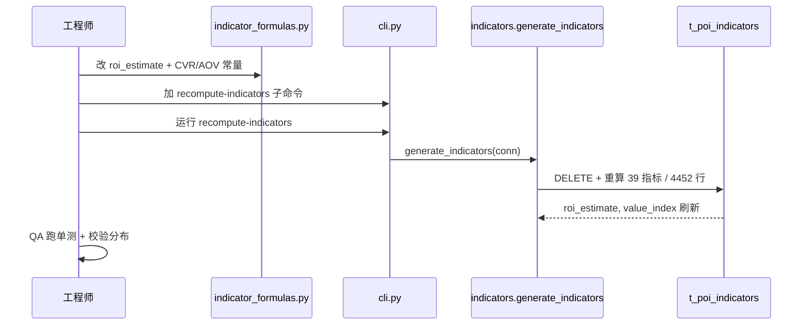

# 增量架构设计：roi_estimate 真实化（L9 · D 类价值分析）

> 仅描述本次变更，不重写子系统整体设计。基于 `docs/incremental_prd_roi_estimate.md`（已拍板）。

## 1. 实现方案
- 改 `backend/app/smart_screen/indicator_formulas.py`：替换占位 `roi_estimate` + 顶部加模块级常量 `CVR`/`AOV`；同步更新 `schema_constants.py` 中 `ALG_V_ROI.formula_hint`（单一事实来源原则，避免算法描述与实现脱节）。
- 不新增文件、不新增依赖。框架保持现状，`roi_estimate` 用纯 Python（clip 用 `min/max`，零新依赖；现有 numpy/pandas 已就绪但不强制引入）。
- **关键澄清（纠正 PRD 第 3 节措辞）**：`roi_estimate(row)` 的 `row` 是**小区宽表行**（`t_community_wide`，由 `generate_indicators` 传入），`daily_reach`/`cpm` 通过调用同文件函数获得，并非读 `t_poi_indicators` 列。实现须调用 `daily_reach(row)`、`cpm(row)`，与现有占位一致。

## 2. 文件列表
| 文件 | 类型 |
|---|---|
| `backend/app/smart_screen/indicator_formulas.py` | 改（roi_estimate 重写 + CVR/AOV 常量） |
| `backend/app/smart_screen/schema_constants.py` | 改（ALG_V_ROI.formula_hint 同步） |
| `backend/app/smart_screen/cli.py` | 改（新增 recompute-indicators 子命令） |
| `backend/tests/test_roi_estimate.py` | 新增（纯函数单测，不依赖 DB） |
| `docs/incremental_prd_roi_estimate.md` | 已存在（输入） |

## 3. 数据结构 / 接口
模块级常量（置于 D 类前）：
```python
CVR = 0.008   # 社区梯媒到店/扫码转化率，区间 0.5%–2% 取中值
AOV = 80.0    # 社区周边客单价（元），区间 50–120 元取中值
```
新实现（签名不变）：
```python
def roi_estimate(row: dict) -> float:
    reach = max(daily_reach(row), 1.0)
    cost = max(cpm(row) * reach / 1000.0, 1e-6)   # = access_lightbox_price（PM 已验证等价）
    revenue = reach * CVR * AOV
    roi = (revenue - cost) / cost
    return round(min(100.0, max(0.0, roi * 50.0 + 50.0)), 2)
```
- `value_index` **不改**（签名不变，自动调用新 `roi_estimate`）。
- CLI 命令：`python -m app.smart_screen.cli recompute-indicators` → 调 `generate_indicators(conn)` 全量重算（DELETE+INSERT，幂等），刷新 `roi_estimate` 与 `value_index` 两列。

## 4. 程序调用流程（时序）

文字：① 改 `roi_estimate` → ② 加 recompute 命令 → ③ 运行重算 4452 行（`value_index` 自动受益）→ ④ 跑单测 + 分布校验。

## 5. 任务列表（有序，按依赖）
- **T1** 重写 `roi_estimate` + 模块级 `CVR`/`AOV` 常量；同步 `schema_constants.ALG_V_ROI.formula_hint`。依赖：无。优先级 P0。
- **T2** `cli.py` 加 `recompute-indicators` 子命令（调 `generate_indicators`）。依赖：T1。P0。
- **T3** 执行重算：运行 CLI 刷新 4452 行 DB。依赖：T1 + T2。P0。
- **T4** 新增 `backend/tests/test_roi_estimate.py`（已知输入→已知输出，纯函数、不依赖 DB）。依赖：T1。P0。
- **T5** QA 回归：现有 15/15 不破 + 重算分布校验（非空 / 非全 0 / 非全 100 / 方差合理 / 无 NaN 越界）。依赖：T3 + T4。P0。

## 6. 依赖包列表
**无新增**。`numpy>=1.26.0` / `pandas>=2.2.0` / `scikit-learn>=1.3.0` 已在 `requirements.txt`；P0 用纯 Python，不引 sklearn。

## 7. 共享知识（跨文件约定）
- `CVR=0.008`、`AOV=80.0` 为模块级统一常量；P0 不按社区差异化（留 P1）；注释必须标注来源区间。
- ROI 指数 clip 规则：`clip(roi*50+50, 0, 100)`；盈亏平衡→50，ROI≥100%→100，ROI≤−100%→0。
- `roi_estimate` 与 `value_index` 强耦合：重算/刷新须同时更新两列（`generate_indicators` 已覆盖，勿手写单列表更 UPDATE）。
- `row` 来自宽表（`t_community_wide`），`daily_reach`/`cpm` 经函数调用获得；禁止改 `value_index` 签名。
- P0 不接 `contract_amount` / `effect_predict` 校准（留 P1）。

## 8. 待明确事项（≤3）
1. **重算方式**：建议用新增 `recompute-indicators` 子命令调 `generate_indicators`（全量幂等），而非为 `roi_estimate` 单独写增量 UPDATE——后者需手动同步 `value_index`，易漏。请确认。
2. **schema_constants 同步**：是否一并更新 `ALG_V_ROI.formula_hint`？（单一事实来源原则建议更新；P2 需求池亦提及。）本设计默认更新。
3. **单测边界**：PRD 示例 `daily_reach=1000, cpm=20` 因成本极低会饱和为 100；建议补一组中值用例（如 `reach=210, access_lightbox_price=80 → 84.0`）以证明非饱和、分布合理。
4. **主理人已拍板（2026-07-23）**：重算采用方案①全量 `recompute-indicators` → `generate_indicators`（幂等，一次刷新 `roi_estimate` + `value_index` 两列，4452 行），不采用手写增量 UPDATE。该决定已写入工程师实现 brief，设计文档其余内容维持不变。
