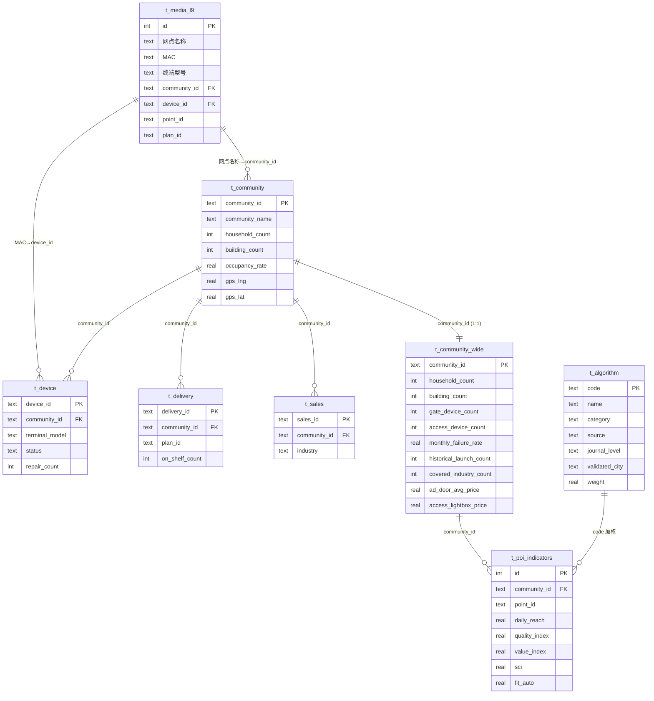
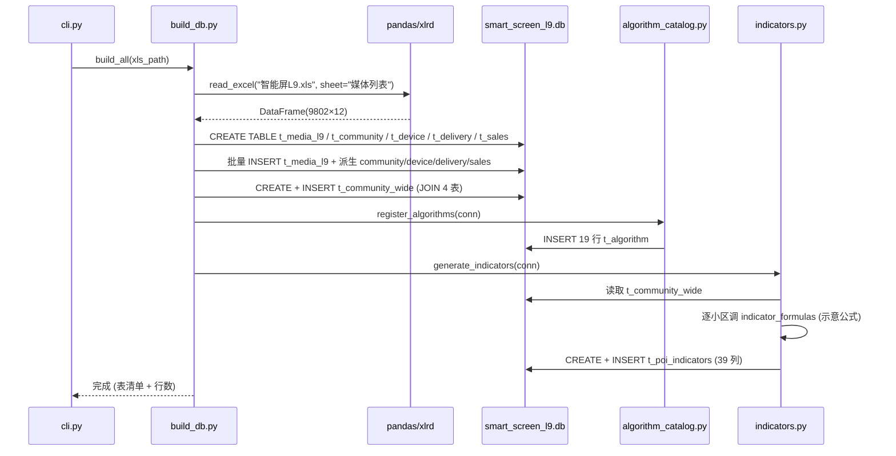
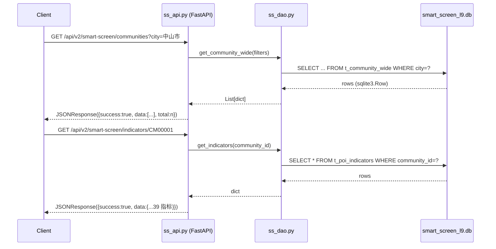
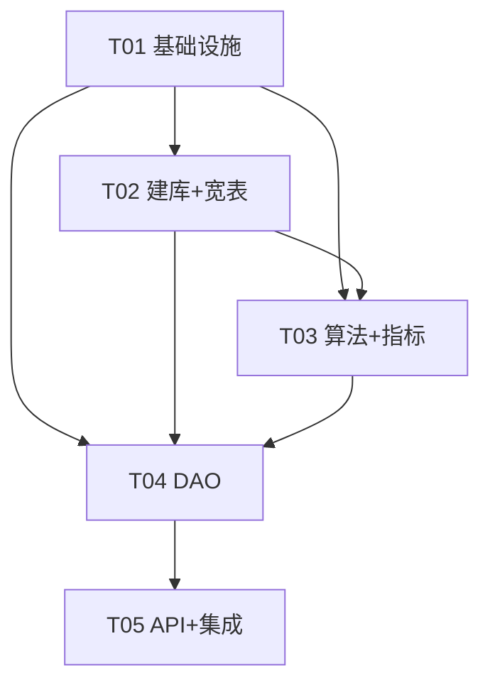

# 智能屏资源子系统（Smart Screen L9）— 系统架构 + 数据库 Schema + 任务分解

> 作者：高见远（架构师）　|　项目：AIAdPlacer（pDOOH 程序化数字户外广告投放平台）
> 数据源：`智能屏L9.xls`（sheet「媒体列表」，**9802 行 × 12 列**，唯一真实数据）
> 落库：独立子系统库 `backend/data/smart_screen_l9.db`

---

## 1. 实现方案与框架选型

### 1.1 技术栈（复用现有项目约定，不另起炉灶）
| 维度 | 选型 | 说明 |
|------|------|------|
| 后端框架 | **FastAPI**（现有 `backend/app/db_api.py` 同款 Router 模式） | 端口 5002，与现有服务共存 |
| 数据库 | **SQLite**（独立库 `smart_screen_l9.db`） | 与现有 `qinlin_local.db` 物理隔离 |
| 数据导入 | **pandas + xlrd==1.2.0** | 一次性构建脚本读 `.xls`（xlrd≥2.0 已移除 xls 支持，必须锁 `<2.0`） |
| 算法注册 | **Python 字典/SQLite 表** | 19 个算法仅注册元数据，逻辑占位 |
| 指标计算 | **Python 启发式函数** | 25+ 指标用示意公式生成，注释标注「示意算法，待替换为真实模型」 |
| 日志/异常 | 复用 `app.common`（`setup_logging` / `PDOOHError` / `ValidationError` / `format_error_response`） | 与现有模块一致 |

### 1.2 为何独立建 `smart_screen_l9.db`（而非塞进 `qinlin_local.db`）
1. **数据主权隔离**：L9 是 9802 行一次性导入的「媒体资源种子库」，与 qinlin 主库的「单元门/道闸/LED 点位」表结构、生命周期完全不同，混库会污染主库 Schema 与备份策略。
2. **独立演进**：四层架构（输入层/关联层/算法层/产出层）需要多张派生表（宽表、算法注册表、指标表），改动频繁；独立库可独立 `WAL`、独立迁移、`DROP`/`CREATE` 不影响主投放链路。
3. **DAO 解耦**：现有 `db_dao.type_to_table` 已含 `"smart_screen_l9": "智能屏L9"`（指向主库预期表），本次**不改动** `db_dao`，新建 `ss_dao.py` 连接独立库，二者命名空间互不冲突。
4. **可重放构建**：`build_db.py` 为幂等构建脚本，删库重跑即可重建，无需纳入 Git 的二进制库也可从 xls 复现。

### 1.3 四层架构 → 物理落库映射
```
[输入层]  t_media_l9(12列原始)  t_community  t_device  t_delivery  t_sales
                         │ (按 网点名称 / MAC 派生)
[关联层]  t_community_wide (小区级宽表, 13字段, 以 community_id 为键 JOIN 4 表)
                         │ (读取宽表字段)
[算法层]  t_algorithm (19 算法注册: code/name/source/journal/city/input_fields/weight)
                         │ (逐算法加权 + 启发式公式)
[产出层]  t_poi_indicators (小区/点位级 39 指标宽表, 7 大类 A~G)
```

---

## 2. 文件清单（新建 + 修改）

| 路径 | 类型 | 说明 |
|------|------|------|
| `backend/data/smart_screen_l9.db` | 新建(脚本生成) | 子系统 SQLite 库，由 `build_db.py` 生成 |
| `backend/app/smart_screen/__init__.py` | 新建 | 包标识 |
| `backend/app/smart_screen/ss_config.py` | 新建 | `DB_PATH` 常量、表名/层名常量、行工厂 |
| `backend/app/smart_screen/schema_constants.py` | 新建 | 四层定义、19 算法目录原始数据、39 指标定义（单一事实来源） |
| `backend/app/smart_screen/build_db.py` | 新建 | 建表 DDL + xls 导入 + 4 表派生 + 宽表构建（幂等） |
| `backend/app/smart_screen/cli.py` | 新建 | `python -m app.smart_screen.cli` 构建入口 |
| `backend/app/smart_screen/algorithm_catalog.py` | 新建 | 19 算法注册表 → 写入 `t_algorithm` |
| `backend/app/smart_screen/indicator_formulas.py` | 新建 | 39 个启发式指标公式函数（标注「示意」） |
| `backend/app/smart_screen/indicators.py` | 新建 | 读取宽表 → 调公式 → 写 `t_poi_indicators` |
| `backend/app/smart_screen/ss_dao.py` | 新建 | 子系统 DAO：连接独立库 + 各类查询 |
| `backend/app/smart_screen/ss_models.py` | 新建 | Pydantic 响应模型 |
| `backend/app/smart_screen/ss_api.py` | 新建 | FastAPI Router（子系统 API） |
| `backend/app/main.py` | 修改 | `include_router(ss_api_router)` |
| `backend/requirements.txt` | 修改 | 追加 `xlrd==1.2.0` |
| `README.md` | 修改 | 新增「智能屏资源子系统」章节 |
| `docs/smart-screen-l9.md` | 新建 | 本设计文档 |
| `docs/ss-er.mermaid` | 新建 | ER 图 |
| `docs/ss-sequence.mermaid` | 新建 | 构建/查询时序图 |
| `docs/ss-class.mermaid` | 新建 | 模块类图 |

---

## 3. 数据库 Schema（完整建表 SQL）

> 约定：表名统一 `t_` 前缀 + 英文；行工厂用 `sqlite3.Row`（与 `db_dao` 一致）。
> 真实数据仅 `t_media_l9`（来自 xls）；`t_community / t_device / t_delivery / t_sales` 由 xls 合理派生（无真实值处留默认/空）；`t_community_wide / t_algorithm / t_poi_indicators` 由构建脚本计算填充。

### 3.1 输入层（Input Layer）

```sql
-- ① 原始媒体列表（12 列与 xls 列名逐一对应，中文列名保持与既有代码一致）
CREATE TABLE IF NOT EXISTS t_media_l9 (
    id            INTEGER PRIMARY KEY AUTOINCREMENT,
    -- ── 12 个原始列（严格对应 xls）──
    所属省份       TEXT,
    所属城市       TEXT,
    "区/县"        TEXT,
    网点名称       TEXT,
    楼盘类型       TEXT,
    住户数         TEXT,        -- 原始为 "--" 等占位，存原文，派生时再 cast
    楼盘价格       TEXT,        -- 原始为 "--"，存原文
    点位名称       TEXT,
    详细地址       TEXT,
    点位ID         TEXT,        -- xls 样例 "448"
    MAC           TEXT,
    终端型号       TEXT,
    -- ── 派生关联键（供关联层 JOIN）──
    community_id  TEXT,         -- 由 网点名称 映射
    device_id     TEXT,         -- = MAC
    media_id      TEXT,         -- 由 终端型号 映射
    point_id      TEXT,         -- = 点位ID
    plan_id       TEXT,         -- 由 community 映射占位
    imported_at   TEXT
);

-- ② BD 小区（crm 系统：小区名/户数/楼栋/入住率/合同金额）—— 由 t_media_l9 按 网点名称 聚合派生
CREATE TABLE IF NOT EXISTS t_community (
    community_id    TEXT PRIMARY KEY,   -- "CM" + 5位序号
    community_name  TEXT,              -- = 网点名称
    province        TEXT,
    city            TEXT,
    district        TEXT,
    household_count INTEGER DEFAULT 0,  -- 户数
    building_count  INTEGER DEFAULT 0,  -- 楼栋数
    occupancy_rate  REAL    DEFAULT 0.0,-- 入住率
    contract_amount REAL    DEFAULT 0.0,-- 合同金额
    gps_lng         REAL,              -- GPS 坐标（L9 无，留 NULL）
    gps_lat         REAL,
    src             TEXT DEFAULT 'derived_from_l9',
    created_at      TEXT
);

-- ③ 工程设备（qadndb：设备ID/状态/安装位置/巡点/维修记录）—— 由 t_media_l9 按 MAC 派生
CREATE TABLE IF NOT EXISTS t_device (
    device_id       TEXT PRIMARY KEY,  -- = MAC
    community_id    TEXT,
    point_id        TEXT,
    terminal_model  TEXT,              -- 终端型号
    status          TEXT DEFAULT '在线',
    install_location TEXT,             -- 安装位置 = 详细地址
    patrol_count    INTEGER DEFAULT 0, -- 巡点
    repair_count    INTEGER DEFAULT 0, -- 维修记录
    install_date    TEXT,
    created_at      TEXT
);

-- ④ 媒介投放（qadndb：投放记录/排期/上刊下刊/媒体类型）—— 每小区占位派生
CREATE TABLE IF NOT EXISTS t_delivery (
    delivery_id       TEXT PRIMARY KEY,
    community_id      TEXT,
    point_id          TEXT,
    device_id         TEXT,
    media_type        TEXT,            -- 媒体类型 = 终端型号
    plan_id           TEXT,
    schedule_start    TEXT,            -- 排期上刊（占位 NULL）
    schedule_end      TEXT,            -- 下刊（占位 NULL）
    on_shelf_count    INTEGER DEFAULT 0,-- 上刊次
    created_at        TEXT
);

-- ⑤ 销售选点（crm：客户/报价/选点偏好/行业/预算）—— 每小区占位派生
CREATE TABLE IF NOT EXISTS t_sales (
    sales_id              TEXT PRIMARY KEY,
    community_id          TEXT,
    customer_name          TEXT,        -- 客户（无数据留 '—'）
    quote                  REAL DEFAULT 0,-- 报价
    selection_preference   TEXT,        -- 选点偏好
    industry               TEXT,        -- 行业
    budget                 REAL DEFAULT 0,-- 预算
    created_at             TEXT
);
```

### 3.2 关联层（Association Layer）— 小区级宽表

```sql
-- 以 community_id 为键 JOIN 4 表 → 小区级宽表（13 业务字段 + PK）
CREATE TABLE IF NOT EXISTS t_community_wide (
    community_id          TEXT PRIMARY KEY,
    household_count       INTEGER DEFAULT 0,   -- 户数
    occupancy_rate        REAL    DEFAULT 0.0, -- 入住率
    building_count        INTEGER DEFAULT 0,   -- 楼栋数
    gate_device_count     INTEGER DEFAULT 0,   -- 大门设备数
    access_device_count   INTEGER DEFAULT 0,   -- 门禁设备数
    monthly_failure_rate  REAL    DEFAULT 0.0, -- 月故障率
    historical_launch_count INTEGER DEFAULT 0, -- 历史上刊次
    covered_industry_count  INTEGER DEFAULT 0, -- 覆盖行业数
    ad_door_avg_price     REAL    DEFAULT 0.0,-- 广告门均价
    access_lightbox_price REAL    DEFAULT 0.0,-- 门禁灯箱价
    historical_customer_industry TEXT,         -- 历史客户行业
    gps_lng               REAL,
    gps_lat               REAL
);
```

### 3.3 算法层（Algorithm Layer）— 19 算法注册表

```sql
CREATE TABLE IF NOT EXISTS t_algorithm (
    code           TEXT PRIMARY KEY,   -- 算法编码 (ALG_XXX)
    name           TEXT,               -- 算法名称
    category       TEXT,               -- 所属产出大类 A~G
    source         TEXT,               -- 学术来源
    journal_level  TEXT,               -- 期刊级别 (SCI/Q1/CSSCI/EI/CCF A...)
    validated_city TEXT,               -- 验证城市
    input_fields   TEXT,               -- JSON 数组: 使用的宽表字段
    weight         REAL DEFAULT 1.0,   -- 加权权重
    formula_hint   TEXT,               -- 示意公式
    description    TEXT,
    status         TEXT DEFAULT 'registered'  -- registered / placeholder
);
```

### 3.4 产出层（Output Layer）— 点位/小区级 39 指标宽表

```sql
-- 7 大类共 39 指标（>25）。point_id 为 NULL 时表示小区级聚合。
CREATE TABLE IF NOT EXISTS t_poi_indicators (
    id               INTEGER PRIMARY KEY AUTOINCREMENT,
    community_id     TEXT NOT NULL,
    point_id         TEXT,
    -- A. 人口覆盖(5)
    daily_reach       REAL,   -- 日均触达
    building_depth    REAL,   -- 楼栋深度
    dual_touch        REAL,   -- 双触点
    coverage_rate     REAL,   -- 覆盖率
    population_index  REAL,   -- 人口指数
    -- B. 质量评分(5)
    health_score      REAL,   -- 健康度
    timeliness_rate   REAL,   -- 及时率
    activity_score    REAL,   -- 活跃度
    stability_score   REAL,   -- 稳定性
    quality_index     REAL,   -- 质量指数
    -- C. 效果预测(4)
    industry_heat     REAL,   -- 行业热度
    recommend_score   REAL,   -- 推荐分
    peak_season_index REAL,   -- 旺季指数
    effect_predict    REAL,   -- 效果预测
    -- D. 价值分析(5)
    cpm               REAL,   -- CPM
    cost_performance  REAL,   -- 性价比
    sssc_coefficient  REAL,   -- SSSC 系数
    roi_estimate      REAL,   -- ROI 预估
    value_index       REAL,   -- 价值指数
    -- E. 画像标签(5)
    grade_tag         REAL,   -- 档次
    consumption_power REAL,   -- 消费力
    commute_tag       REAL,   -- 通勤
    family_tag        REAL,   -- 家庭
    function_tag      REAL,   -- 功能
    -- F. 空间价值(4)
    integration       REAL,   -- 整合度
    choice            REAL,   -- 选择度
    depth             REAL,   -- 深度
    sci               REAL,   -- SCI
    -- G. 行业适配(11)
    fit_takeout       REAL,   -- 外卖
    fit_ecommerce     REAL,   -- 电商
    fit_fmcg          REAL,   -- 快消
    fit_beauty        REAL,   -- 美妆
    fit_auto          REAL,   -- 汽车
    fit_education     REAL,   -- 教育
    fit_realestate    REAL,   -- 地产
    fit_finance       REAL,   -- 金融
    fit_health        REAL,   -- 医疗健康
    fit_travel        REAL,   -- 旅游
    fit_local         REAL,   -- 本地生活
    computed_at       TEXT
);
```

### 3.5 示例数据（验证用）

```text
-- t_media_l9 (xls 真实样例)
(所属省份=广东省, 所属城市=中山市, 区/县=中山市区, 网点名称=保利国际广场, 楼盘类型=--,
 住户数=--, 楼盘价格=--, 点位名称=二期6号岗, 详细地址=448, 点位ID=448,
 MAC=FE19EA000003, 终端型号=QLG19-C215, community_id=CM00001, device_id=FE19EA000003,
 media_id=QLG19-C215, point_id=448, plan_id=PL00001)

-- t_community_wide (派生后示例)
(community_id=CM00001, household_count=300, occupancy_rate=0.92, building_count=12,
 gate_device_count=4, access_device_count=9, monthly_failure_rate=0.02,
 historical_launch_count=3, covered_industry_count=1, ad_door_avg_price=800.0,
 access_lightbox_price=1200.0, historical_customer_industry='', gps_lng=NULL, gps_lat=NULL)
```

---

## 4. ER 图（Mermaid）



---

## 5. 调用流程时序图（Mermaid）

### 5.1 构建流程（build_db）



### 5.2 查询流程（API）



---

## 6. 任务列表（有序，含依赖，给工程师）

| Task | 名称 | 依赖 | 优先级 | 源文件 |
|------|------|------|--------|--------|
| **T01** | 项目基础设施与常量 | — | P0 | `smart_screen/__init__.py`, `smart_screen/ss_config.py`, `smart_screen/schema_constants.py`, `requirements.txt`(改) |
| **T02** | 输入层 + 关联层建库（xls 导入 + 派生宽表） | T01 | P0 | `smart_screen/build_db.py`, `smart_screen/cli.py`, `data/smart_screen_l9.db`(生成) |
| **T03** | 算法注册表 + 产出层指标 | T01, T02 | P0 | `smart_screen/algorithm_catalog.py`, `smart_screen/indicator_formulas.py`, `smart_screen/indicators.py` |
| **T04** | DAO 查询层 | T01, T02, T03 | P1 | `smart_screen/ss_dao.py`, `smart_screen/ss_models.py`, `tests/test_smart_screen_dao.py` |
| **T05** | API 路由 + 集成 + 文档 | T04 | P1 | `smart_screen/ss_api.py`, `main.py`(改), `README.md`(改), `tests/test_smart_screen_api.py` |

### 任务依赖图


**T01 要点**：`ss_config.py` 定义 `SS_DB_PATH = BASE_DIR/"data"/"smart_screen_l9.db"`、`ROW_FACTORY`；`schema_constants.py` 集中定义 `FOUR_LAYERS`、`ALGORITHMS`(19 条)、`INDICATOR_COLUMNS`(39 列)，作为全系统单一事实来源。`requirements.txt` 追加 `xlrd==1.2.0`。
**T02 要点**：`build_db.py` 幂等（`DROP` 若存在再 `CREATE`）；`t_media_l9` 12 列中文名严格对应 xls；派生规则见 §8。`cli.py` 提供 `python -m app.smart_screen.cli --xls <path>`。
**T03 要点**：`algorithm_catalog.py` 从 `schema_constants.ALGORITHMS` 写入 `t_algorithm`；`indicator_formulas.py` 每个函数上方注释 `# 示意算法，待替换为真实模型`；`indicators.py` 逐小区计算 39 列写入 `t_poi_indicators`。
**T04 要点**：`ss_dao.get_ss_db_connection()` 连独立库，`row_factory=sqlite3.Row` + `PRAGMA journal_mode=WAL`；提供 `list_tables / get_community_wide / get_indicators / query_media / get_stats`。
**T05 要点**：`ss_api.py` 定义 `ss_api_router = APIRouter(prefix="/api/v2/smart-screen", tags=["智能屏资源"])`；在 `main.py` 注册；`README.md` 新增子系统章节。

---

## 7. 依赖包

```
# 运行时（已在 requirements.txt）
fastapi>=0.104.0
uvicorn[standard]>=0.24.0
pandas>=2.2.0
# 子系统新增
xlrd==1.2.0          # 仅 build 阶段读 .xls 需要，必须 <2.0（≥2.0 已移除 xls 支持）
# 内置，无需安装
sqlite3              # Python 标准库
```

---

## 8. 共享约定（跨模块，工程师必须遵守）

1. **DB 路径常量**：所有模块统一 `from app.smart_screen.ss_config import SS_DB_PATH`，禁止硬编码路径。
2. **行工厂**：`conn.row_factory = sqlite3.Row`，返回 `dict`（`dict(row)`）。
3. **统一错误处理**：API 层复用 `from app.common import setup_logging, PDOOHError, ValidationError, format_error_response`；响应体统一 `{"success": bool, "data"|"error":..., "code":..., "total"?:...}`，与 `db_api.py` 风格一致。
4. **字段双语命名**：建表用中文业务名（与 xls/既有库一致），代码层用 `schema_constants` 的英文常量做字段映射；响应体返回中文列名 + 英文 key 双命名（见 `ss_models.py`）。
5. **派生默认策略**（无真实值时）：
   - `住户数`/`楼盘价格` 原文为 `"--"` → 存原文，`t_community.household_count` 派生为 `building_count * 100`（占位）。
   - `t_community.building_count` = `max(1, round(该小区点位数量 / 3))`（占位）。
   - `occupancy_rate` 默认 `0.92`；`ad_door_avg_price` 默认 `800.0`；`access_lightbox_price` 默认 `1200.0`；`gps_*` 默认 `NULL`。
   - 设备数拆分：`gate_device_count = round(device_count * 0.3)`，`access_device_count = device_count - 大门数`（占位，注释标明）。
6. **构建幂等**：`build_db` 先 `DROP TABLE IF EXISTS` 再 `CREATE`，重跑可重建；`PRAGMA journal_mode=WAL`。
7. **算法/指标占位标注**：所有 19 算法 `status='registered'`；所有指标公式函数首行注释 `# 示意算法，待替换为真实模型`。

---

## 9. 待明确事项（Assumptions & Open Questions）

1. **`智能屏L9.xls` 不在仓库内**：按团队提供的 12 列结构 + 9802 行设计；实际构建前需将 xls 放到 `backend/data/` 或传 `--xls` 路径。**（已假设结构无误）**
2. **「点位ID」列样例值为 `448`**：疑似行号或内部编码，已按 `TEXT` 存原文；若实为数值主键需后续校正。
3. **GPS 坐标缺失**：L9 数据无经纬度，`gps_*` 留 `NULL`；空间价值类指标（F 类整合度/选择度/SCI）暂以占位公式生成，待补坐标后接真实空间算法。
4. **其余 3 个输入表（BD小区/工程设备/媒介投放/销售选点）无真实数据**：已按 xls 合理派生并标注 `src='derived_from_l9'`；待真实 crm/qadndb 数据接入时替换派生逻辑。
5. **19 算法未实现完整逻辑**：仅注册元数据（来源/期刊/城市/输入字段/权重）；`formula_hint` 为示意，待数据科学团队补真实模型。
6. **指标阈值与归一化范围**：39 指标当前输出为相对分值（0–100 或原始量纲混合），统一归一化区间与业务阈值待产品/算法确认。
7. **与 `db_dao.type_to_table["smart_screen_l9"]="智能屏L9"` 的关系**：主库映射保留不动；本子系统独立库表名为 `t_media_l9` 等，互不冲突。若后续需在主库「智能屏L9」表与子库对齐，需另行 ETL。
8. **计划 ID（plan_id）来源**：关联层第 5 纽带「计划ID」当前无投放计划数据，由 community 占位生成 `PLxxxxx`；待 t_delivery 接入真实排期后回填。

---

## 附录 A：19 算法注册目录（节选，完整见 `schema_constants.ALGORITHMS`）

| code | name | category | source | journal_level | validated_city | weight |
|------|------|----------|--------|---------------|----------------|--------|
| ALG_POP_REACH | 日均触达 | A | 城市户外广告受众测量模型 | CSSCI | 广州 | 1.0 |
| ALG_POP_DEPTH | 楼栋深度 | A | 社区媒体触达深度模型 | CSSCI | 深圳 | 0.8 |
| ALG_POP_DUAL | 双触点 | A | 多触点整合曝光理论 | SSCI Q1 | 北京 | 0.9 |
| ALG_POP_COVER | 覆盖率 | A | 覆盖率测算方法 | — | 上海 | 1.0 |
| ALG_POP_INDEX | 人口指数 | A | 人口密度与触达指数 | CSCD | 成都 | 0.7 |
| ALG_Q_HEALTH | 健康度 | B | 设备健康度评估 | EI | 广州 | 1.0 |
| ALG_Q_TIMELY | 及时率 | B | 上刊及时率模型 | NSFC | 深圳 | 0.9 |
| ALG_Q_ACTIVE | 活跃度 | B | 广告活跃度指数 | SSCI Q1 | 杭州 | 0.8 |
| ALG_Q_STABLE | 稳定性 | B | 故障率与稳定性 | — | 武汉 | 0.85 |
| ALG_Q_INDEX | 质量指数 | B | 综合质量评估AHP | — | 广州 | 1.0 |
| ALG_E_HEAT | 行业热度 | C | 行业搜索热度指数 | CSSCI | 北京 | 1.0 |
| ALG_E_RECO | 推荐分 | C | 协同过滤推荐 | CCF A | 上海 | 0.95 |
| ALG_E_PEAK | 旺季指数 | C | 季节性销售指数 | CSSCI | 广州 | 0.8 |
| ALG_E_PREDICT | 效果预测 | C | 投放效果回归预测 | SSCI Q1 | 深圳 | 1.0 |
| ALG_V_CPM | CPM | D | CPM定价模型 | — | 广州 | 1.0 |
| ALG_V_COST | 性价比 | D | ROI性价比模型 | CSSCI | 北京 | 0.9 |
| ALG_V_SSSC | SSSC系数 | D | 场景-受众-空间-成本模型 | — | 上海 | 1.0 |
| ALG_V_ROI | ROI预估 | D | 广告ROI归因 | — | 深圳 | 0.95 |
| ALG_V_INDEX | 价值指数 | D | 综合价值TOPSIS | — | 广州 | 1.0 |

> 注：产出层 39 指标中，E（画像5）、F（空间4）、G（行业适配11）由宽表字段经启发式公式直接生成（如 `daily_reach = household_count * occupancy_rate * 2.1`），无需逐项对应 19 算法；19 算法为后续真实模型预留注册位。
